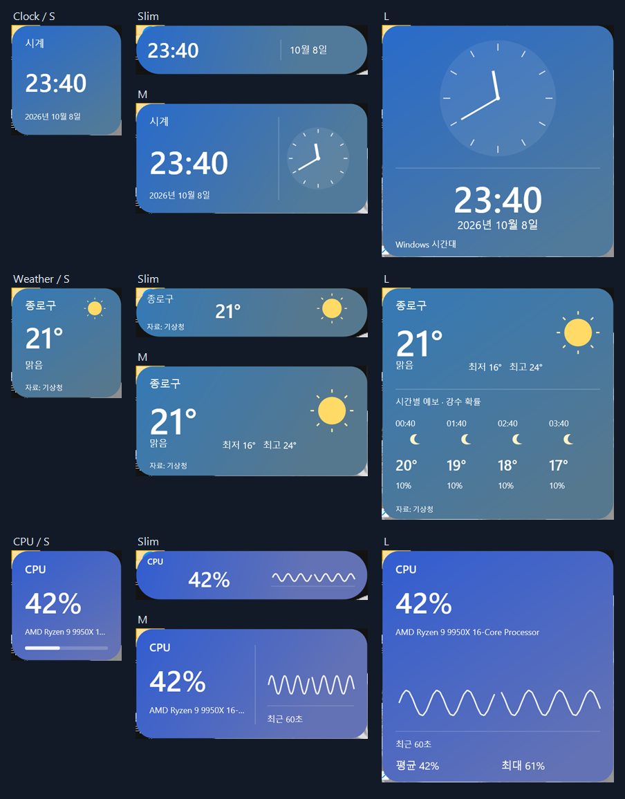
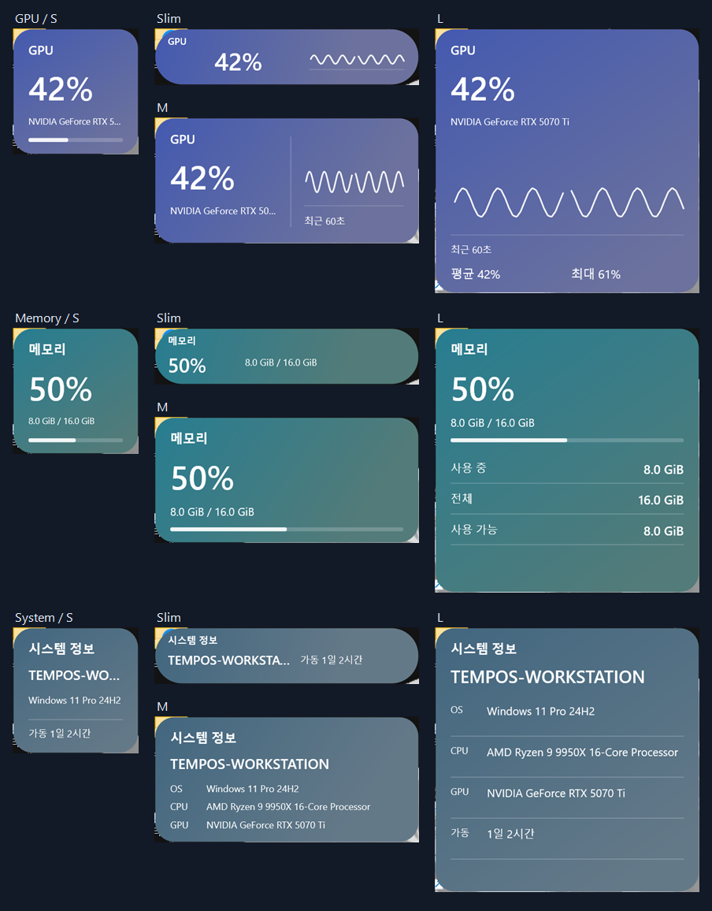
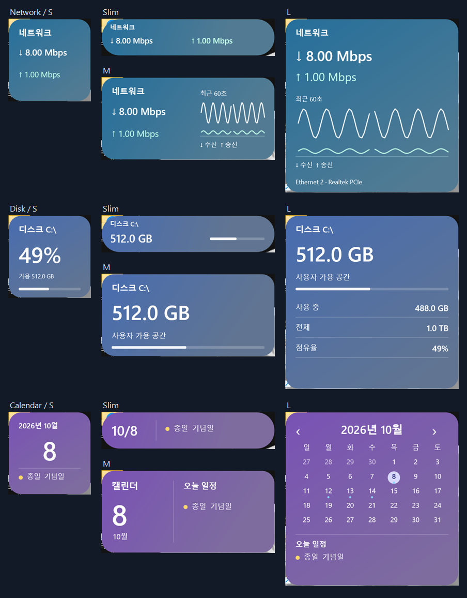
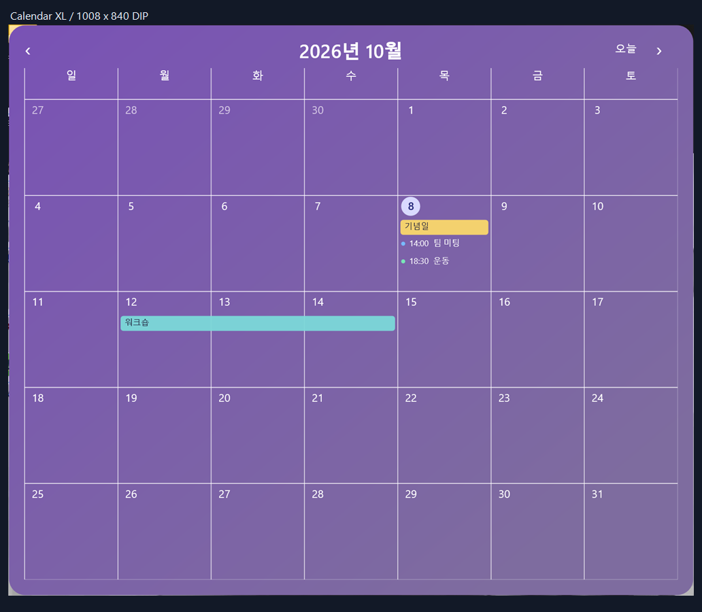
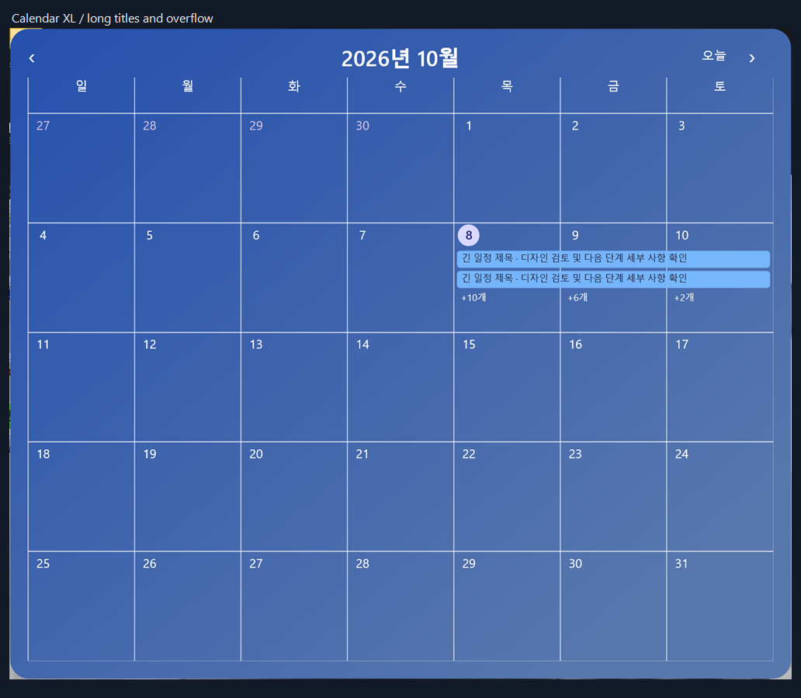
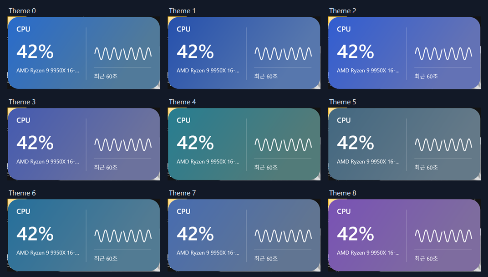
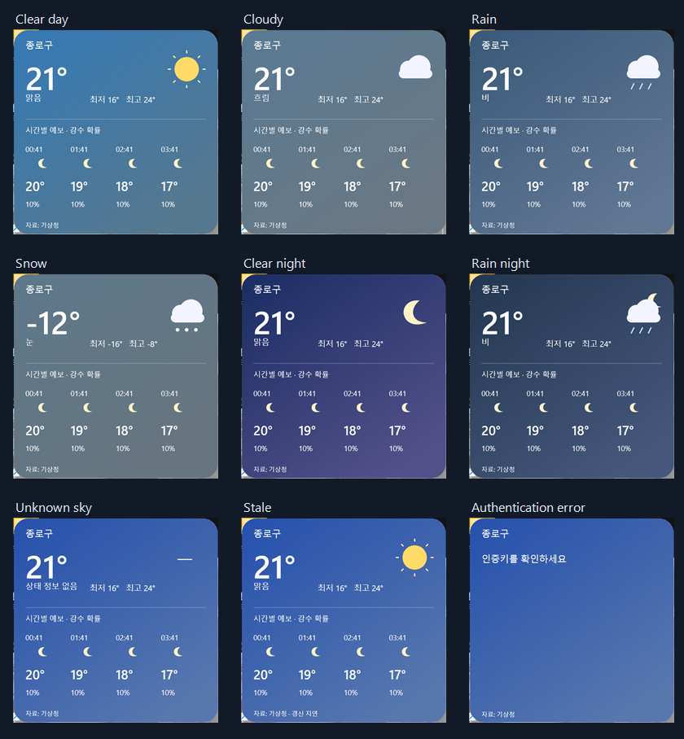
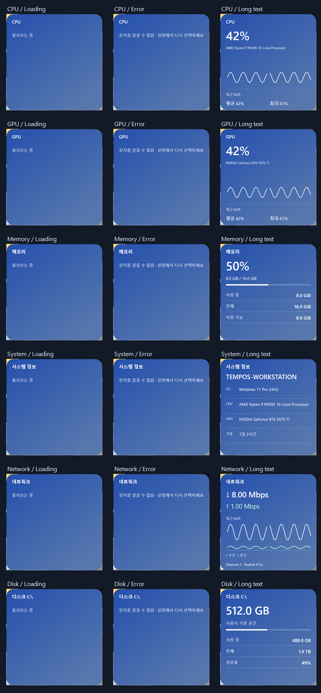
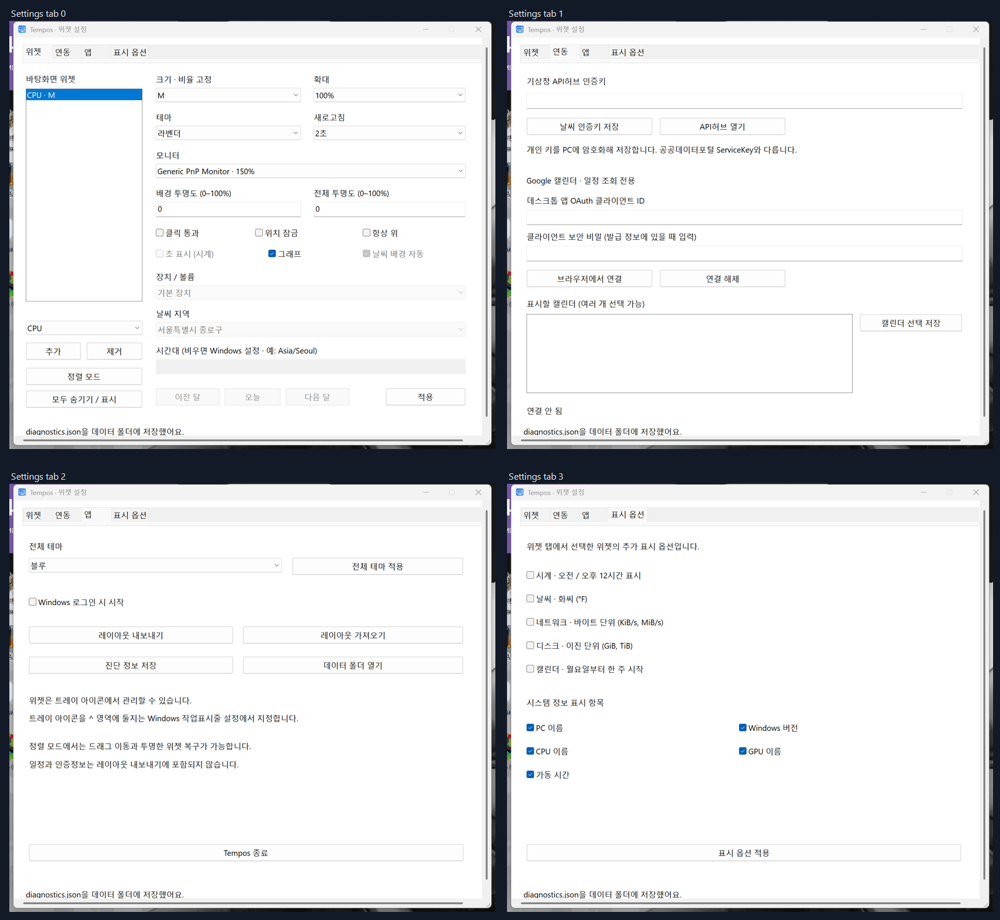

# 디자인 검수 결과 · 2026-10-08

[기준 가이드](../../design-guide.md)의 D01~D11을 기준으로 [계획](../../../plan.md)의 크기별 정보와 Concept 01 이미지를 실제 Win32 창과 비교했다. 아래 이미지는 테스트 호스트의 네이티브 위젯을 화면에서 캡처한 것이며 합성 UI 시안이 아니다. 그래프·날씨·장치명·일정은 제작용 자료다. 둥근 카드 밖 모서리에 보이는 부분은 실제 바탕화면이다.

실행: `test-results/e2e-20261008-234010`, 자동 확인 494개 통과. 37개 구성 + 9개 팔레트 + 설정 4개 탭 + 상태 29개, 총 79개 캡처를 만들었다. 자동 확인은 저장·크기·표시·소유 창·히트 테스트를 검사하며, 글자 배치와 정보 구성은 아래 비교표 및 이미지의 육안 검수 결과다. 현재 화면 DPI는 144, 위젯 배율은 100%다. 배경 투명도 0%의 기준 캡처이며 기본값 10%와 구분한다.

## 시안 대비 확인·수정

| 대상 | 발견한 차이 | 검수 후 상태 |
| --- | --- | --- |
| 시계 S/Slim/M/L | S 12시간 문구 겹침, M 아날로그 없음, L 정보 위계 차이 | 오전/오후 분리, M 작은 아날로그, L 큰 아날로그와 아래 시간·날짜·시간대. 12/24시간·초 조합은 별도 E2E |
| 날씨 4종 | L 예보 아이콘 없음, 6칸 밀집, 긴 상태 문구 겹침 | 다음 4시간 아이콘·기온·강수 확률, 상태 영역 분리, 출처 유지 |
| 날씨 상태 | 야간 예보에도 해, 비 오는 밤이 낮과 같은 배경 | 예보 시각별 일출/일몰 판정, 밤의 비·눈 팔레트, 비 오는 밤의 달. 불명확한 상태와 갱신 지연은 별도 문구 |
| CPU/GPU 8종 | Slim/M 그래프 없음, L 최대 없음 | Slim 추이, M 모델과 60초 추이, L 평균/최대. 긴 이름은 작은 구성에서 말줄임 |
| 메모리 4종 | Slim 용량 없음, L 상세 구분 부족 | Slim 용량, L 사용 중·전체·사용 가능. 제작용 용량/사용률도 일치 |
| 시스템 4종 | 작은 구성에 모든 필드를 밀어 넣음 | S PC/OS/가동, Slim PC/가동, M 짧은 정보, L 전체 정보. 긴 L 장치명은 두 줄 허용 |
| 네트워크 4종 | M 그래프 없음, L 범례 없음 | M/L 공통 시간축의 수신·송신 그래프, 방향 라벨과 기간 표시 |
| 디스크 4종 | 사용자 가용과 볼륨 여유 혼동, Slim 가용 공간 없음 | S 점유율·가용, Slim/M/L 사용자 가용, L 전체/점유/볼륨 여유 구분 및 중복 생략. 볼륨 경로 표시 |
| 캘린더 5종 | 긴 일정 줄바꿈, 연결 전 상태가 일정 없음으로 보임 | 한 줄 말줄임, 연결 안내, 월간형의 종일·여러 날 일정·+N 유지, L 하단 여백 수정 |
| 9개 팔레트 | 밝은 배경의 작은 흰 글자 대비 부족 | 원본 후보 색상의 색조를 유지하면서 명도를 조정. 불투명 배경 끝점 각각 4.5:1 이상 검사 |
| 설정 4개 탭 | 시안과 다른 네이티브 UI | 라벨·입력·버튼의 겹침은 발견하지 않음. 시안과 남은 차이는 아래에 명시 |

## 실제 화면

## 남은 시안 차이와 범위

- 설정은 네이티브 탭 방식이다. 시안의 카드 미리보기·미리보기 취소·투명도 슬라이더·오른쪽 배치 편집 패널은 미구현이다. 현재는 적용 버튼으로 저장하고 실제 바탕화면에서 확인한다.
- CPU/GPU 등의 장식 아이콘·그래프 면 채움·시안의 광원 효과는 생략되어 있다. 그래프는 유효 표본의 선과 결측 구간을 표시한다.
- 팔레트 밝기는 가독성을 위해 후보 시안과 다르며, 모든 위젯은 공통 테마를 선택할 수 있다. 종류별 색을 고정하지 않는다.
- S의 긴 PC/모델명과 일정은 말줄임한다. 날짜 선택의 상세 창과 설정·L 구성에서 추가 정보를 확인한다. 시안의 최종 제품 디자인이 확정됐다고 선언하지 않는다.
- 뇌우·안개·일몰 장면은 현재 공급자가 확실하게 식별하는 별도 상태가 아니므로 꾸며 표시하지 않는다. 날씨 상태 이미지는 공급자 연동 성공을 뜻하지 않는다.
- 고대비 모드·모든 배경화면에서의 대비·모든 배율×테마×상태의 전체 조합·실제 인증 계정은 이번 육안 검수 범위 밖이다. DPI/배율과 표시 옵션의 기능 검사는 별도 E2E 기록을 참조한다.

따라서 이번 결과는 내장 카드의 37개 구성과 명시한 상태·설정 화면을 검수한 결과이며, 계획 전체의 모든 후보·인수 조건을 구현 완료했다는 판정은 아니다.
