# Tempos 프로젝트 설계

작성일: 2026-10-07
상태: 9종 위젯 구현과 로컬 E2E 검증 완료. 실제 계정 연결·24시간 장기 실행 등 남은 인수 검증은 [개발·검증 기록](docs/development.md)에 구분해 기록한다.

2026-10-08 구현 메모: 렌더링 실측 후 기본 경로를 공유 Direct2D DC + UpdateLayeredWindow로 조정했다. DirectComposition은 비교 구현으로 보존한다. 바탕화면 연결은 실제 Windows 11에서 표시를 검증한 SHELLDLL_DefView 자식 경로를 사용한다. 구현 범위, 수치와 미검증 인수 조건은 [개발·검증 기록](docs/development.md)이 최신 기준이며 아래 설계 목표와 구분한다.

## 1. 만들고 싶은 제품

**가볍게 상주하면서, 여러 모니터의 바탕화면에 필요한 정보를 아름답게 배치하는 Windows 위젯 앱.**

사용자는 코드를 수정하지 않고 위젯을 추가하고, 위치와 크기를 조정하고, 마음에 드는 배치를 저장할 수 있어야 한다. 주 모니터에는 시계와 날씨를 간결하게 두고, 보조 모니터에는 시스템 상태를 모아 볼 수 있는 제품을 지향한다.

### 확정 요구사항

- Windows 바탕화면 위젯으로 동작한다.
- 매우 낮은 CPU·메모리 사용량과 메모리 누수 방지를 최우선으로 한다. 성능 예산을 넘는 효과와 기능은 배포 전에 조정한다.
- 다중 모니터를 기본 사용 환경으로 고려한다.
- 시계, 날씨, 시스템 정보, CPU 사용량, GPU 사용량을 제공한다.
- 최종 디자인은 나중에 결정한다. 외형을 바꾸기 쉬운 구조를 먼저 설계한다.
- 위젯은 모니터별 그리드에 정렬하고, 선택한 형태의 가로·세로 비율을 유지해서 확대한다.
- 갱신 주기와 투명도는 위젯별로 지정한다.
- 날씨 배경은 현재 날씨와 해당 도시의 낮·밤에 맞춰 바뀐다. 비·눈·구름 등은 저비용 정적 표현을 사용한다.
- 국내 날씨는 기상청 API허브를 우선 연동안으로 한다. 인증키·발표/갱신 주기·격자 범위·출처 표시 제약은 18절을 따른다. Open-Meteo는 해외 지역 확장 후보로 남긴다.
- 기존 시안의 색상은 모든 위젯에 적용할 수 있는 공통 테마로 제공한다. 전체 기본값과 위젯별 선택을 지원한다.
- 실행 중에는 앱당 트레이 아이콘 하나로 관리한다. 위젯 창은 작업표시줄의 일반 앱 버튼에 표시하지 않는다.
- 앱 아이콘은 사용자가 선택한 4번 ‘시스템 모니터’로 확정한다.
- 캘린더는 Google Calendar 조회 전용 연동을 지원한다. 일정 추가·수정·삭제·참석 응답은 제공하지 않는다. 서비스 이름과 연결 관리는 설정 화면에만 둔다.
- 배터리, 집중 타이머, 메모·체크리스트는 제품 및 시안 범위에서 제외한다.
- 사용자가 개발 시작을 지시했다. 9종 전체를 구현하고 각 단계마다 E2E 테스트→실패 수정→재검증을 수행한다.
- 아래의 설계 당시 ‘현재는 설계만’ 표기는 작성 이력이다. 현재 작업 범위와 완료 판단은 이 확정 요구사항 및 docs/development.md를 따른다.

### 설계 기본값

- 1차 지원 대상은 Windows 11 x64, 한국어 UI로 제안한다. Windows 10·ARM64는 후속 호환성 검토 대상이다.
- 카드형·타이포 중심·대시보드형은 동등한 디자인 후보로 남긴다. 제품의 기본 스타일은 아직 선정하지 않는다.
- 첫 버전은 개인 사용 중심의 로컬 앱으로 설계한다. 회원가입과 별도 서버를 요구하지 않는다.
- 아래의 기술 선택과 성능 수치는 설계 제안이며, 성능 수치는 실측 결과가 아니다.

## 2. 기존 프로그램에서 참고할 점

공식 문서와 프로젝트 자료를 바탕으로 비교했다. 프로그램을 직접 설치해 성능이나 호환성을 비교한 결과는 아니다. 기능과 사용 방식은 참고하되, 기존 제품의 스킨·아이콘·브랜딩을 복제하지 않는다.

| 참고 제품 | 자료에서 확인한 특징 | Tempos에 반영할 설계 |
| --- | --- | --- |
| [Rainmeter](https://docs.rainmeter.net/manual/arranging-skins/) | 자유 이동, 가장자리 스냅, 화면 안에 유지, 창 표시 순서, 그룹 이동 | 자유 배치·스냅·위치 잠금·클릭 통과를 기본 조작으로 제공한다. 고급 조정도 설정 화면에서 처리한다. |
| [Rainmeter의 화면 위치 설정](https://docs.rainmeter.net/manual/settings/skin-sections/) | 모니터 지정, 화면 비율과 가장자리 기준 위치 저장 | 모니터별 배치를 저장하고, 해상도 변경에도 가장자리와의 관계를 유지한다. |
| [BeWidgets](https://docs.bexcool.com/bewidgets/layouts) | 위젯 묶음을 레이아웃으로 저장하고 불러오기 | 업무·집중·모니터링 배치를 이름 붙여 저장한다. 첫 실행에는 완성된 기본 배치를 제공한다. |
| [Zebar](https://github.com/glzr-io/zebar/blob/main/README.md) | 위젯 팩, 시스템 트레이 관리, 공통 데이터 공급자, 웹뷰 기반 위젯 | UI와 데이터 수집을 분리하고 같은 지표는 여러 위젯이 공유한다. 초기 버전은 내장 위젯에 집중한다. |
| [Windows Widgets](https://learn.microsoft.com/en-us/windows/apps/design/widgets) | 한눈에 읽는 정보와 간단한 동작, 크기에 따라 정보량이 달라지는 카드 | 위젯마다 핵심 정보를 먼저 보여주고 크기가 커지면 상세 정보를 추가한다. |

Windows Widgets의 공식 호스트는 위젯 보드이므로, Tempos의 바탕화면 상주 기능은 독립 데스크톱 앱으로 구현한다. 위 표의 ‘Tempos에 반영할 설계’는 조사 내용을 바탕으로 한 자체 제안이다.

**Tempos의 집중점:** 교체 가능한 외형과 일관된 조작, 설정하기 쉬운 배치, 모니터 연결 변화에 대한 복원, 위젯 수가 늘어도 중복되지 않는 데이터 수집.

## 3. 위젯 구성 제안

### 3.1 첫 버전에 포함할 위젯

| 위젯 | 기본 표시 | 조정할 수 있는 항목 |
| --- | --- | --- |
| 시계·날짜 | 큰 디지털 시계, 요일, 날짜 | 12/24시간제, 초 표시, 시간대, 날짜 형식 |
| 날씨 | 선택한 도시, 현재 기온, 날씨 아이콘, 최고·최저 기온, 날씨·시간대별 배경 | 도시 검색, 섭씨/화씨, 간결한 표시/상세 표시, 자동 날씨 배경/고정 테마 |
| CPU | 전체 사용률, 최근 60초 추이 | 숫자 중심/그래프 포함, 표시 크기 |
| GPU | 선택한 GPU 이름, 사용률, 최근 60초 추이 | 내장·외장 GPU 선택, GPU별 위젯 추가 |
| 메모리 | 물리 메모리 사용률, 사용량/전체 용량 | 간결한 숫자/사용량 막대 |
| 시스템 요약 | PC 이름, OS 버전, CPU·GPU 모델, 부팅 후 경과 시간 | 표시 항목 선택 |

첫 실행 기본 배치는 **시계·날씨·CPU·GPU·메모리 5개**로 한다. 시스템 요약은 갤러리에서 추가한다. 같은 종류의 위젯을 여러 모니터에 중복 배치할 수 있으며, 같은 데이터를 사용하면 수집 결과를 공유한다.

날씨는 사용자가 도시를 선택하기 전까지 설정 안내를 보여준다. 실제 위치를 추정하거나 임의의 도시 날씨를 표시하지 않는다.

### 3.2 추가하면 좋은 위젯

| 우선순위 | 위젯 | 제안 이유와 범위 |
| --- | --- | --- |
| 다음 버전 | 네트워크 | 업로드·다운로드 속도와 작은 그래프. 어댑터를 선택해 VPN 등의 중복 합산을 피한다. |
| 다음 버전 | 디스크 | 선택한 드라이브의 여유 공간과 사용률. 초기에는 용량 조회에 집중한다. |
| 다음 버전 | 캘린더 | 오늘·다가오는 일정과 월간 달력. Google Calendar 조회 전용 연동 및 날짜 칸 안에 일정을 표시하는 큰 월간형 포함. |
| 다음 버전 | 세계 시계·D-day | 여러 시간대와 일정까지 남은 일수. 기존 시계 구조를 재사용한다. |
| 확장 | 미디어 컨트롤 | Windows 미디어 세션을 제공하는 앱의 곡 정보와 재생 제어. |
| 확장 | 앱·폴더 바로가기 | 자주 여는 항목을 작은 런처로 배치한다. |
| 확장 | 오디오 | 현재 출력 장치와 음량, 음소거. 장치 전환을 포함할 수 있다. |
| 확장 | 대기질 | 미세먼지·초미세먼지 등. 지역별 데이터 제공 범위와 출처를 먼저 확인한다. |
| 확장 | 온도·팬·전력·VRAM | 하드웨어와 드라이버별 수집 가능 범위가 다르므로 별도 공급자로 확장한다. |
| 장기 검토 | RSS·다른 일정 서비스 | Google Calendar 외의 추가 서비스는 별도 검토한다. |

초기 범위에서는 외부 플러그인 실행, 스킨 마켓, 클라우드 동기화, 실시간 오디오 비주얼라이저, 동영상 배경을 제외한다. 우선 기본 위젯의 동작, 외형 교체 가능성, 상주 비용을 검증한다.

## 4. 디자인을 나중에 결정할 수 있는 구조

**최종 색상, 폰트, 카드 형태, 기본 크기, 정보 배치는 미정이다.** 먼저 외형을 교체할 수 있는 경계를 만들고, 시안을 비교한 뒤 제품 디자인을 확정한다.

### 외형을 세 층으로 분리

| 층 | 변경 대상 | 지켜야 할 경계 |
| --- | --- | --- |
| 디자인 토큰 | 색, 폰트, 글자 크기, 여백, 모서리, 테두리, 배경 불투명도, 효과 | 위젯 코드에 개별 수치를 흩어 놓지 않고 테마 리소스로 관리 |
| 위젯 표현 템플릿 | 배경 유무, 숫자·라벨·아이콘·그래프의 배치와 표시 여부 | 동일 데이터 모델을 카드형·텍스트형 등 서로 다른 구성으로 표현 |
| 바탕화면 레이아웃 | 모니터, 기준점, 위치, 논리 크기, 위젯 조합 | 테마를 바꿔도 인스턴스 ID·설정·모니터 소속·저장 위치 유지 |

- 디자인 토큰과 내장 표현 템플릿을 네이티브 렌더러와 분리한다. 데이터 수집·위젯 상태·창 관리가 특정 카드 모양에 의존하지 않게 한다.
- 표현 스타일 패키지는 토큰, 위젯별 템플릿, 지원 크기 프리셋을 묶는다. 색상 팔레트는 별도 선택한다. 크기와 배치는 템플릿이 정의하고 데이터 공급자는 관여하지 않는다.
- 전체 테마를 바꾸거나 특정 위젯에만 외형을 지정할 수 있게 한다. 개별 지정이 없는 위젯은 전체 테마를 따른다.
- 스타일이나 색상 테마를 전환해도 수집을 다시 시작하거나 데이터를 잃지 않는다. 표현 스타일 교체로 크기가 달라질 때만 기존 기준점에서 화면 안으로 보정한다. 색상 테마 변경은 크기를 유지한다.
- 테마에 일부 위젯 표현이 없으면 내장 기본 표현으로 표시한다. 초기에는 앱에 포함한 템플릿만 사용하며, 외부 실행형 스킨 로딩까지 확장하지 않는다.
- 다크·라이트와 Windows 테마 추종을 표현 옵션으로 지원한다. 색상 외에도 폰트 대체, 고대비, 모션 감소와 배경 가독성을 고려한다.
- 상시 애니메이션·실시간 배경 블러는 첫 버전 성능 범위에서 제외한다. 외형의 유연성이 지속적인 렌더링 부하를 전제하지 않게 한다.

### 모든 위젯이 공유하는 색상 테마

**위젯 종류에 색을 고정하지 않는다.** 기존 시안의 색을 이름 있는 팔레트로 분리한다. 색상을 선택하는 UI 이름은 ‘테마’이며, 정보 배치·카드형/텍스트형을 선택하는 ‘스타일’과 구분한다. 색상 테마 변경은 위젯의 위치·크기·비율·표시 항목을 바꾸지 않는다.

| 테마 ID | 표시 이름 | 그라데이션 기준색 | 기존 시안의 출발점 |
| --- | --- | --- | --- |
| `sky` | 스카이 | `#286BCC` → `#6EA5D1` | 맑은 낮 날씨 |
| `blue` | 블루 | `#2550AD` → `#668BCA` | 시계 |
| `cobalt` | 코발트 | `#315DD1` → `#6C7CC5` | CPU |
| `indigo` | 인디고 | `#445AB0` → `#8188BB` | GPU |
| `teal` | 틸 | `#277D91` → `#72ACA9` | 메모리 |
| `slate` | 슬레이트 | `#426780` → `#819CAF` | 시스템 정보 |
| `ocean` | 오션 | `#256F9B` → `#70A7C7` | 네트워크 |
| `steel` | 스틸 | `#476CB0` → `#849FC6` | 디스크 |
| `lavender` | 라벤더 | `#7952B5` → `#A28BCD` | 캘린더 S~XL |

위 값은 현재 시안에서 추출·정리한 후보 토큰이며 최종 색은 후속 가독성 검토에서 조정할 수 있다. 모든 팔레트를 모든 위젯의 지원 크기에 적용한다. 예를 들어 CPU를 라벤더로, 캘린더 XL을 틸로 바꿀 수 있다.

- 앱 설정의 ‘테마’에서 전체 기본 테마를 고른다. 첫 실행 제안값은 블루이며 사용자가 바꿀 수 있다. 종류별로 다른 색을 강제하지 않는다.
- 위젯 설정에는 ‘전체 테마 따르기’와 9개 개별 테마를 둔다. 새 위젯의 기본은 전체 따르기다. 개별 지정은 다른 모니터의 같은 종류 위젯에도 영향을 주지 않는다.
- 전체 기본을 바꾸면 이를 따르는 위젯만 바뀐다. 명시적인 ‘모든 위젯을 전체 테마로 맞추기’는 개별 색상 지정을 해제한다. 날씨의 자동/고정 배경 모드는 별도로 유지한다.
- 미리보기 후 저장하며 취소하면 원래 팔레트로 돌아간다. 색상 변경은 데이터 재조회·그래프 초기화·창 재생성을 유발하지 않는다.
- 팔레트는 배경·글자·보조 글자·구분선·그래프 색을 묶는다. 캘린더별 일정 색과 오류 등 의미를 가진 강조색은 별도 의미 토큰으로 보존한다. 색에 더해 라벨·선 종류로 정보를 구분한다.
- 날씨는 기본 ‘날씨에 맞춰 자동’이다. 자동 모드에서는 날씨 장면이 배경색을 정하며, ‘고정 테마’를 선택하면 공통 팔레트를 쓴다. 어느 모드에서도 날씨 아이콘과 상태 문구는 실제 데이터에 맞춘다.
- 배경·전체 투명도는 테마와 독립적으로 유지한다. 글자 뒤의 정적 명암 보정도 배경 투명도를 따르며, 투명도를 몰래 되돌리지 않는다. 가독성은 미리보기에서 확인하고 필요 시 글자 외곽선 표현을 선택한다. 배경화면을 지속 캡처해서 색을 추정하지 않는다.
- Windows 고대비 모드는 장식과 팔레트보다 우선한다. 테마 자체에는 애니메이션·실시간 블러를 포함하지 않는다.

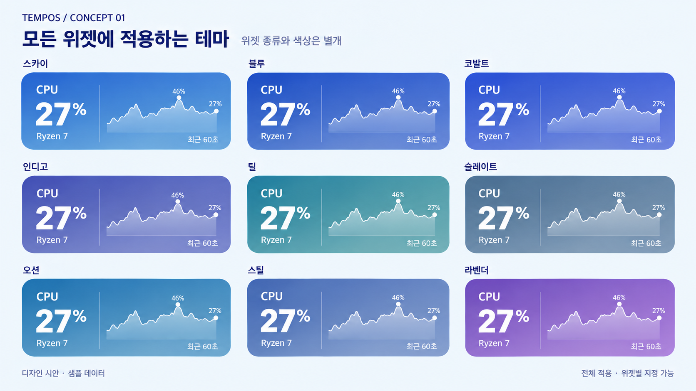

각 카드의 내용은 같은 샘플이다. 기존 위젯별 시안의 색상은 해당 팔레트를 선택한 예시로 읽으며, 종류별 고정색 사양이 아니다.

### 비교할 디자인 후보

| 후보 | 사용 장면 | 검토할 특징 |
| --- | --- | --- |
| Minimal Card | 정보 구분이 명확한 정돈된 바탕화면 | 여백, 큰 숫자, 단색 또는 반투명 배경 |
| Typography | 배경화면을 최대한 살리고 싶은 사용자 | 배경 없는 시계와 정보, 타이포그래피 중심 |
| Monitor | 보조 모니터를 상태판으로 쓰는 사용자 | 작은 수치와 선형 그래프, 높은 정보 밀도 |

세 후보 중 어느 것도 현재 기본 디자인으로 확정하지 않는다. 초기 기술 검증에는 단순한 배경형·무배경형 두 표현을 사용해, 같은 위젯 데이터로 외형을 바꿀 수 있는지 확인한다. 완성된 테마 세 개를 먼저 구현할 필요는 없다.

검증용 예시 수치는 위젯 사이 간격 16 DIP, 내부 여백 16 DIP, 크기 160×160·336×160·336×336 DIP다. DIP는 Windows 배율과 독립적인 논리 크기이며, 이 수치는 토큰과 템플릿에만 두고 제품 사양으로 고정하지 않는다. 폰트는 시스템 기본 폰트로 시작하고, 숫자 갱신 시 폭이 흔들리지 않는지도 확인한다.

### 갤럭시 날씨 위젯을 참고한 시안: Concept 01

사용자가 제시한 [아티의 IT 연구소의 갤럭시 날씨 위젯 글](https://blog.naver.com/artismart/224334916129)의 모바일 페이지와 실제 이미지를 확인했다. 둥근 모서리, 파란 그라데이션, 큰 흰색 숫자, 단순한 해·구름 아이콘, 요약과 상세 정보를 나누는 구성을 참고했다. 원본 이미지는 결과물에 포함하지 않고 Tempos용 시안을 새로 제작했다.

**기본 6종과 추가 3종 × 4개 크기 = 36개 구성**, 그리고 캘린더 XL 월간형을 비교한다. 추가 3종은 네트워크·디스크·캘린더다. 이 시안은 선택 가능한 디자인 후보이며, 기존의 ‘최종 디자인 미정’ 원칙을 유지한다. 규격은 템플릿별 기준이며, 사용 중에는 선택한 규격의 비율을 고정한다.

| 크기 | 제안 규격 | 사용 목적 | 정보 구성 원칙 |
| --- | --- | --- | --- |
| S | 160×160 DIP | 모서리나 작은 빈 공간 | 핵심 숫자·상태와 최소한의 보조 정보 |
| Slim | 336×72 DIP | 화면 위·아래의 얇은 정보 줄 | 가로 한 줄로 핵심 내용을 압축 |
| M | 336×160 DIP | 일반적인 가로 위젯 | 왼쪽 요약, 오른쪽 아이콘·그래프·보조 정보 |
| L | 336×336 DIP | 보조 모니터의 상세 정보 | 요약과 상세 영역을 위아래로 분리 |

S 두 개와 사이 간격 16 DIP를 합치면 M·L의 가로폭과 맞고, Slim 두 개와 간격 16 DIP는 S·M의 높이와 맞는다. 배치를 맞추기 위한 규격 제안이며 갤럭시의 홈 화면 셀 수와 직접 같은 단위는 아니다.

### 위젯별 크기에 따른 표시 항목

| 위젯 | S | Slim | M | L |
| --- | --- | --- | --- | --- |
| 날씨 | 도시·현재 기온·아이콘, 공간이 허용되면 최고/최저 | 아이콘·기온·도시를 가로 정렬, 최고/최저는 공간에 따라 생략 | 현재 날씨와 큰 아이콘, 짧은 상태 요약 | 현재 날씨 + 다음 4시간의 기온·아이콘·강수 확률 |
| 시계·날짜 | 디지털 시각·날짜 | 시각과 날짜를 한 줄로 배치 | 디지털 시각·날짜 + 작은 아날로그 표현 | 큰 아날로그 표현 + 디지털 시각·전체 날짜·시간대 |
| CPU | 전체 사용률과 얇은 사용량 막대 | 사용률과 작은 추이 그래프 | 사용률·모델명 + 최근 60초 그래프 | 사용률·모델명·60초 그래프 + 평균/최대 |
| GPU | 선택한 GPU의 사용률·짧은 모델명 | 사용률과 작은 추이 그래프 | 사용률·모델명 + 최근 60초 그래프 | 사용률·모델명·60초 그래프 + 평균/최대 |
| 메모리 | 사용률·사용량/전체·막대 | 사용률과 용량을 가로 정렬 | 사용률·사용량·전체 용량·가로 막대 | 사용률·막대 + 사용 중/사용 가능/전체 |
| 시스템 정보 | PC 이름·OS·가동 시간 | PC 이름과 가동 시간 | PC 이름·OS·짧은 CPU/GPU 모델명 | PC 이름·OS·전체 CPU/GPU 모델명·가동 시간 |
| 네트워크 | 다운로드·업로드 속도 | 양방향 속도를 가로 정렬 | 양방향 속도 + 60초 추이 | 선택한 어댑터·양방향 그래프와 범례 |
| 디스크 | 볼륨 점유율·사용 가능 공간 | 드라이브·사용 가능 공간·점유 막대 | 사용자 가용 공간 + 전체 점유 막대 | 전체·점유·볼륨 여유·사용자 가용 구분, 같은 값은 중복 생략 |
| 캘린더 | 오늘 날짜·다음 일정 | 날짜와 다음 일정 한 줄 | 오늘 날짜 + 오늘 일정 목록 | 월간 날짜 그리드 + 선택일 일정 |

큰 크기를 단순 확대판으로 만들지 않고 정보를 추가하거나 재배치한다. 작은 크기에 맞추기 위해 중요한 수치를 지나치게 작게 줄이지 않는다. 긴 모델명은 작은 위젯에서는 축약하고, 전체 이름은 큰 위젯이나 상세 화면에서 확인할 수 있게 한다.

시계의 아날로그 표현은 동일 시각을 그리는 템플릿 옵션이다. CPU·GPU의 평균은 최근 60초에 겹치는 유효 구간 길이로 가중하고 최대는 실제 유효 샘플에서 계산하며 추가 센서를 요구하지 않는다. 날씨 L의 시간별 예보는 같은 도시의 공유 요청에 필요한 예보 필드를 추가한다. ‘오후에도 맑아요’ 같은 요약은 예보를 근거로 표시할 때만 사용한다. 디스크의 실제 볼륨 여유와 사용자 가용 공간은 할당량에 따라 다를 수 있으며 16.10절의 구분을 따른다.

### 시안 이미지

내장 `image_gen` 도구로 생성했다. 값과 장치명은 샘플이며 실제 PC 측정 결과가 아니다. 이미지 내부의 비율·글자·그래프는 시각적 검토용으로, 픽셀 단위 구현 도면을 대신하지 않는다. 규격은 위 표를 기준으로 한다.

| 위젯 | 이미지 | 색상 방향 |
| --- | --- | --- |
| 날씨 | [4개 크기 비교](design/galaxy-v1/01-weather.png) | 하늘색·노란 해 |
| 시계·날짜 | [4개 크기 비교](design/galaxy-v1/02-clock.png) | 코발트·연한 청색 |
| CPU | [4개 크기 비교](design/galaxy-v1/03-cpu.png) | 청색·보랏빛 |
| GPU | [4개 크기 비교](design/galaxy-v1/04-gpu.png) | 인디고·회청색 |
| 메모리 | [4개 크기 비교](design/galaxy-v1/05-memory.png) | 청록색 |
| 시스템 정보 | [4개 크기 비교](design/galaxy-v1/06-system.png) | 차분한 회청색 |
| 네트워크 | [4개 크기 비교](design/galaxy-v1/07-network.png) | 청색·청록색 |
| 디스크 | [4개 크기 비교](design/galaxy-v1/08-disk.png) | 청색·회청색 |
| 캘린더 | [4개 크기 비교](design/galaxy-v1/10-calendar.png) | 보라색, 서비스 이름 표시 없음 |
| 캘린더 XL | [월간 일정형](design/galaxy-v1/15-calendar-monthly.png) | 기존 캘린더와 같은 보라색·흰 글자, 날짜 칸 안에 일정 표시 |

위젯별 색상 차이도 이번 시안의 후보일 뿐이다. 전체 위젯을 같은 팔레트로 통일하거나 개별 테마를 지정할 수 있는 기존 구조를 유지한다. 생성에 사용한 최종 프롬프트와 참고 관계는 [기본 시안 프롬프트](design/galaxy-v1/prompts.json)와 [추가 시안 프롬프트](design/galaxy-v1/prompts-additional.json)에 보관한다.

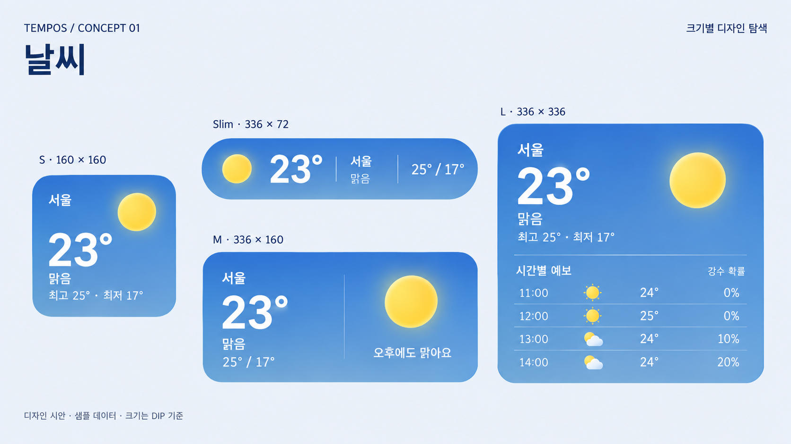

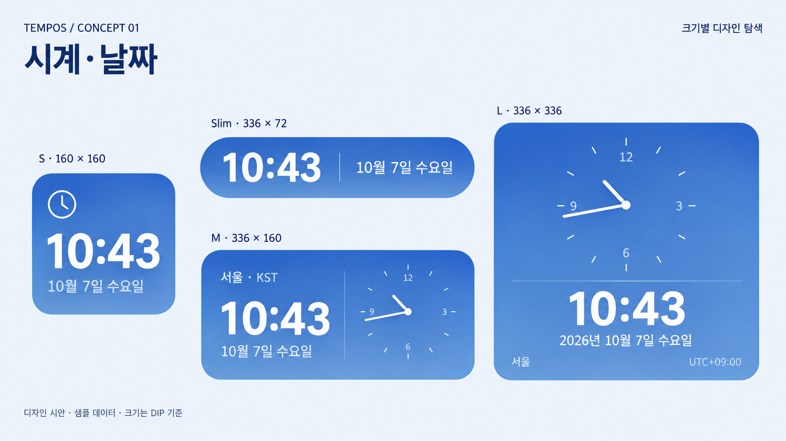

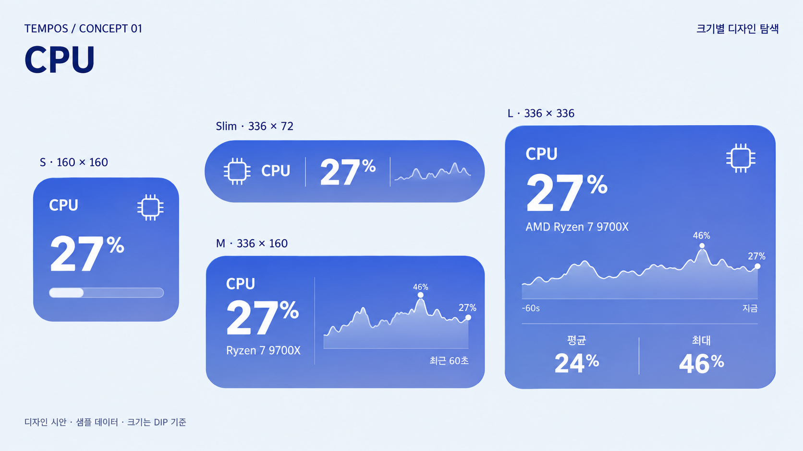

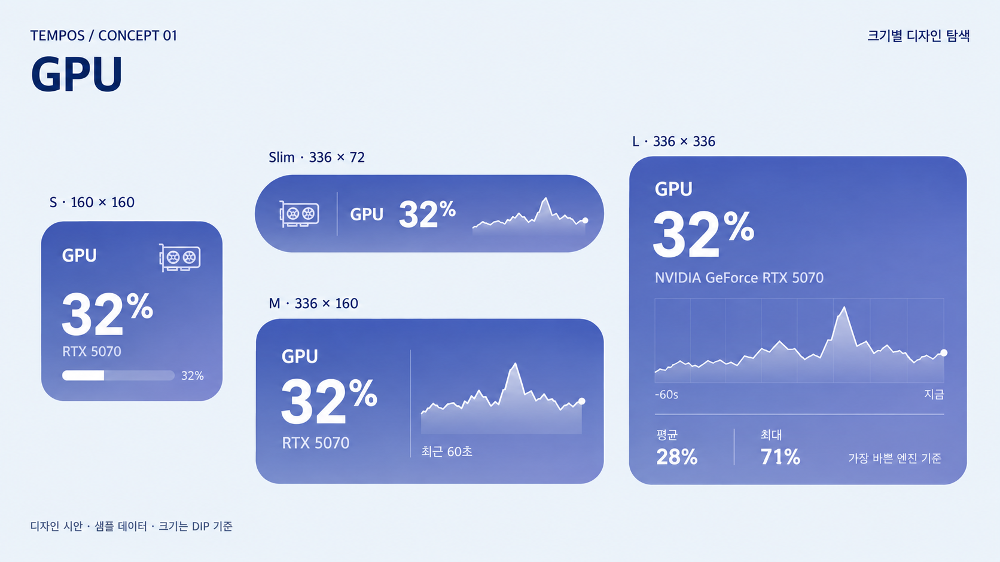

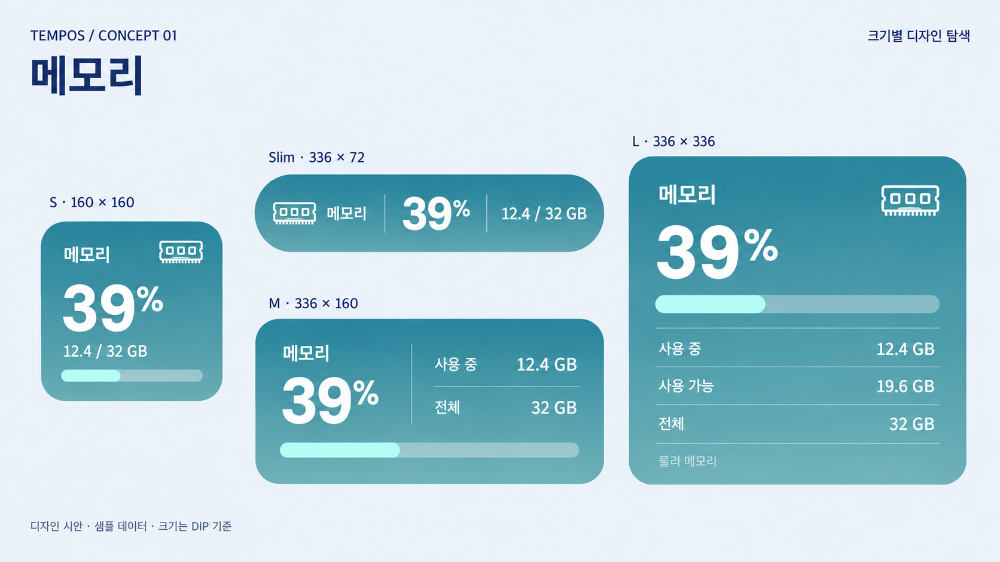

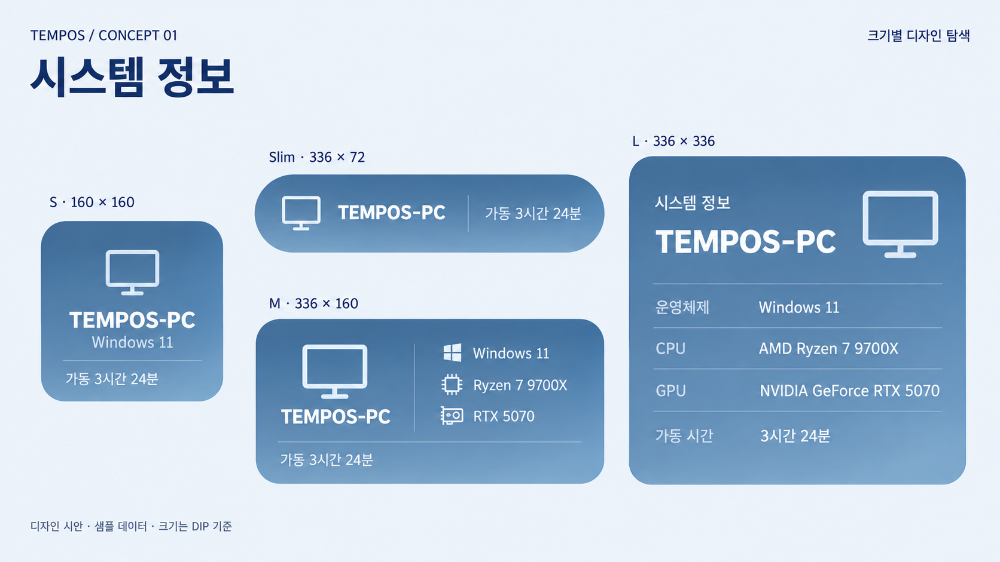

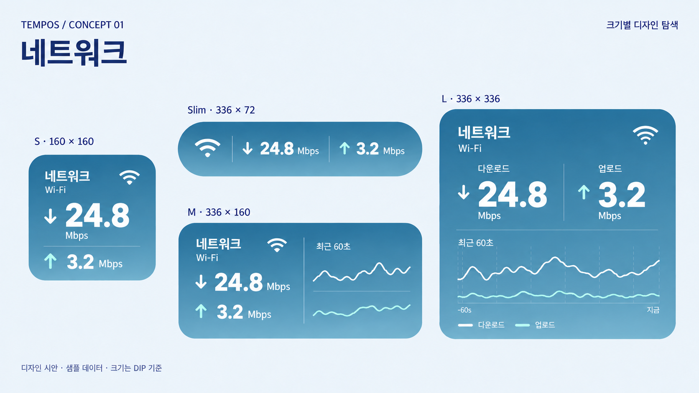

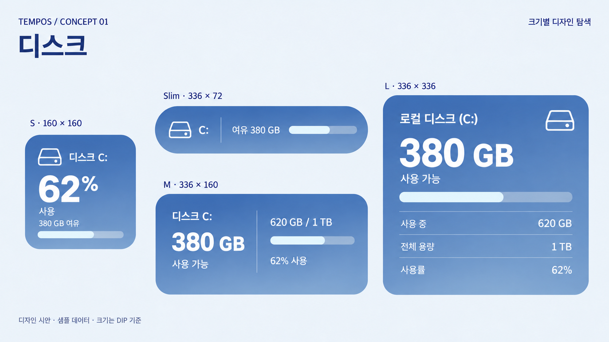

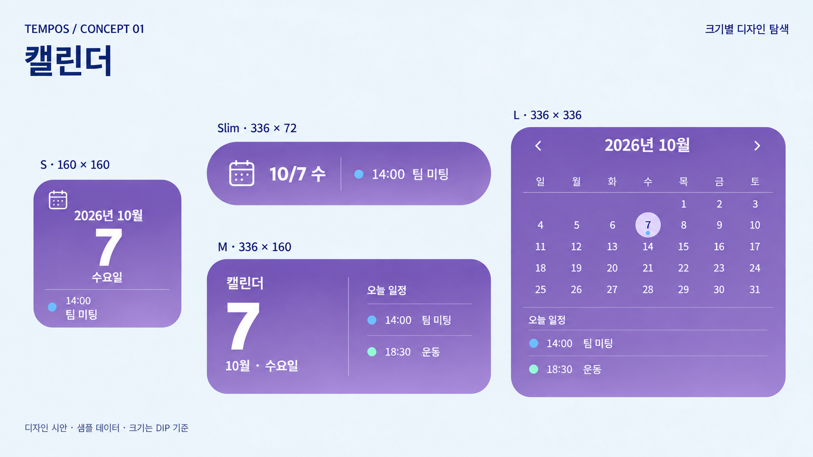

### 비율을 유지하는 크기 조절

- S·L은 1:1, M은 21:10, Slim은 14:3 비율을 고정한다. 가로·세로를 따로 늘리는 조작은 제공하지 않는다.
- 편집 모드에서 모서리 핸들을 드래그하거나 100%·150%·200%를 선택한다. 드래그를 놓을 때 가장 가까운 허용 배율로 맞춘다. 초기 최소 크기는 각 프리셋의 100%다.
- 글자·아이콘·여백도 같은 배율로 확대한다. 확대만으로 표시 항목을 늘리지 않는다. S/M/L 형태 전환은 별도 조작이다.
- 최종 물리 크기는 `기준 DIP 크기 × 위젯 확대 배율 × 모니터 DPI 배율`로 계산한다. 두 종류의 배율을 혼동하지 않는다.
- 화면 크기나 다른 위젯과의 간격 때문에 놓을 수 없는 배율은 선택할 수 없게 한다. 임의로 가로·세로를 줄여 비율을 깨지 않는다.

| 형태 | 100% | 150% | 200% |
| --- | --- | --- | --- |
| S | 160×160 | 240×240 | 320×320 |
| Slim | 336×72 | 504×108 | 672×144 |
| M | 336×160 | 504×240 | 672×320 |
| L | 336×336 | 504×504 | 672×672 |

### 위젯별 투명도

- 설정에 ‘배경 투명도’와 ‘전체 투명도’를 제공한다. UI의 0%는 불투명, 100%는 완전 투명이며 5% 단위로 조절한다.
- 기본은 배경 투명도 10%, 전체 투명도 0%다. 배경만 투명하게 하면 글자와 아이콘의 가독성이 유지된다.
- 저장 값은 `backgroundOpacity`와 `windowOpacity`의 0~1 값이다. 배경의 최종 알파는 두 값을 곱하고, 글자·아이콘에는 전체 알파만 적용한다.
- 완전 투명해도 위치와 설정은 유지한다. 트레이에서 편집 모드로 진입하면 임시로 읽을 수 있는 투명도와 테두리를 적용하고, 완료 시 저장 값을 복원한다.
- 투명도와 클릭 통과는 별도 설정이다. 투명도를 조절했다고 자동으로 클릭 통과를 켜지 않는다.
- 알파 합성만 사용한다. 실시간 블러·배경 캡처·투명도 애니메이션은 사용하지 않는다.

### 배치 예시

| 모니터 | 추천 배치 |
| --- | --- |
| 주 모니터 | 오른쪽 위에 시계와 날씨, 작업 공간은 넓게 유지 |
| 보조 가로 모니터 | 오른쪽에 CPU·GPU·메모리 위젯 세로 배치 |
| 보조 세로 모니터 | 위쪽 시계, 아래쪽 시스템 위젯과 일정 |

이 배치는 프리셋이며 강제하지 않는다. 첫 실행에는 주 모니터 안에서 사용 가능한 공간에 맞게 기본 위젯을 배치한다.

## 5. 사용 흐름과 조작

1. 첫 실행에서 기본 배치를 표시하고, 날씨 도시와 테마를 간단히 설정한다. 로그인 시 자동 실행은 사용자가 켠 경우에만 활성화한다.
2. 시스템 트레이에서 위젯 추가, 배치 편집, 전체 숨기기, 레이아웃, 설정, 종료에 접근한다.
3. 위젯 갤러리에서 미리보기를 보고 추가할 모니터와 크기를 고른다.
4. 편집 모드에서는 위젯을 모니터별 그리드에 배치하고, 형태와 고정 비율 확대 배율을 선택한다. 그리드 스냅과 비율 고정을 우회하는 자유 변형은 제공하지 않는다.
5. 편집을 마치면 위치를 잠근다. 변경 사항은 자동 저장하며, 현재 배치를 별도 이름으로도 저장할 수 있다.

평상시에는 포커스를 빼앗지 않는다. 표시 전용 위젯에는 클릭 통과 옵션을 제공하며, 기본은 꺼짐이다. 클릭 통과가 켜져 있어도 트레이에서 편집 모드로 진입하면 조작할 수 있다. 위치 잠금과 클릭 통과는 별개 옵션이다.

설정 창에는 모니터별 위젯 목록과 ‘이 화면으로 가져오기’를 제공한다. 키보드로 위젯 선택, 위치 조정, 삭제가 가능하게 하고, 드래그만으로 조작해야 하는 기능을 만들지 않는다.

관리 화면은 필요할 때 열고 닫으며, 닫아도 위젯은 유지된다. 트레이의 ‘종료’는 위젯과 수집 작업을 모두 종료한다.

### 트레이 상주와 숨겨진 아이콘 영역

- 평상시에는 바탕화면 위젯과 **Tempos 트레이 아이콘 1개**만 유지한다. 위젯 개수·모니터 개수에 따라 트레이 아이콘을 늘리지 않는다. 각 위젯 창은 일반 작업표시줄 버튼과 Alt+Tab 목록에서 제외한다.
- 첫 실행에는 짧은 설정 화면을 제공한다. 이후 실행과 사용자가 켠 로그인 시 자동 실행에서는 저장된 배치를 복원하고 관리 창을 자동으로 띄우지 않는다. 사용자가 설정 창을 열었을 때만 그 창의 작업표시줄 버튼과 Alt+Tab 진입을 허용한다.
- 트레이 좌클릭 또는 키보드 실행은 관리 화면을 연다. 우클릭 메뉴는 ‘위젯 추가 / 배치 편집 / 전체 숨기기·표시 / 레이아웃 / 테마 / 설정 / 종료’다. ‘전체 숨기기’ 후에도 아이콘은 남아 복원할 수 있다.
- 관리 창의 X는 관리 UI 자원을 해제하고 위젯을 유지한다. 앱 종료는 트레이의 ‘종료’로 명확히 구분한다. 관리 화면에도 같은 종료 명령을 제공해 트레이에 접근할 수 없는 경우를 대비한다.
- 사용자가 말한 숨겨진 아이콘(`^`) 메뉴에서 접근할 수 있는 표준 알림 영역 아이콘으로 등록한다. **`^` 안에 둘지 항상 노출할지는 Windows와 사용자가 결정한다. 앱이 위치를 강제하거나 사용자 설정을 덮어쓰지 않는다.** 설정에 Windows 작업표시줄 설정 안내를 제공한다. [Windows 트레이 표시 설정](https://support.microsoft.com/en-us/windows/experience/personalization/customize-the-taskbar-in-windows)
- 확정 아이콘인 4번의 모니터·그래프 형태를 트레이에서도 사용한다. 작은 크기에서 선 굵기·여백을 다듬고 밝고 어두운 작업표시줄에서 구분되게 한다. 아이콘을 애니메이션하거나 CPU 수치를 매초 그려 넣지 않는다.
- 앱 중복 실행은 기존 인스턴스의 관리 화면만 연다. 트레이 등록에 실패하면 조작 경로가 사라지지 않도록 일반 관리 창을 보여주고 제한된 재시도를 한다. 불필요한 시작 알림은 띄우지 않는다.

구현 단계에서는 안정적인 GUID로 `Shell_NotifyIcon`을 등록하고 버전 4 콜백·키보드 접근을 사용한다. 종료 시 아이콘을 제거한다. `NIS_HIDDEN`으로 아이콘 자체를 숨기는 동작을 overflow 배치와 혼동하지 않는다. [알림 영역 API](https://learn.microsoft.com/en-us/windows/win32/shell/notification-area)

셸의 `TaskbarCreated` 메시지를 받을 수 있는 숨겨진 최상위 호스트 창을 두고 Explorer 재시작 시 아이콘을 재등록한다. 위젯 창의 작업표시줄 제외는 창 스타일/소유 관계로 처리하고 지원 Windows 빌드에서 확인한다. [작업표시줄과 복구 메시지](https://learn.microsoft.com/en-us/windows/win32/shell/taskbar)

## 6. 바탕화면과 멀티 모니터 동작

### 바탕화면 표시 규칙

- 기본 모드는 바탕화면에 붙어 있는 상태다. 일반 앱은 위젯을 가릴 수 있고, Win+D로 바탕화면을 보면 위젯이 보여야 한다.
- 위젯은 작업 표시줄과 Alt+Tab 목록에 개별 앱처럼 나타나지 않는다. 관리 창은 일반 창으로 동작한다.
- ‘항상 위’는 사용자가 켤 수 있는 별도 모드로 둔다.
- Explorer 재시작 후 바탕화면 연결과 트레이 아이콘을 복구한다.
- 바탕화면 아이콘, 우클릭 메뉴, 드래그 선택과의 입력 충돌을 검사한다.

바탕화면 고정은 단순히 창을 맨 아래로 보내는 것만으로 충족됐다고 판단하지 않는다. Win32 창 계층·Z-order 처리를 `DesktopHost`에 격리하고, Win+D와 Explorer 재시작을 초기 검증 항목으로 둔다. WorkerW 등 문서화되지 않은 셸 동작이 필요하다면 의존 범위와 검증한 OS 빌드를 기록한다. 실패 시 일반 창으로 표시하는 복구 모드는 제공할 수 있지만, 이를 정상적인 바탕화면 모드의 완료로 간주하지 않는다.

### 모니터별 바탕화면 그리드

- Tempos 위젯만 그리드에 배치한다. Windows 바탕화면 아이콘의 위치·정렬 설정은 변경하지 않는다.
- 각 모니터 작업 영역 안쪽 16 DIP를 시작 여백으로 두고, 좌표 계산은 4 DIP 기본 격자로 한다. 화면에는 편집 중에만 16 DIP 간격의 옅은 주 격자를 표시한다.
- 4 DIP 보조 격자는 Slim의 150% 높이인 108 DIP까지 정확히 정렬하기 위한 단위다. 드래그·키보드 이동은 4 DIP에 맞추고 Shift+방향키는 16 DIP 이동한다.
- 위젯끼리는 최소 16 DIP 간격을 유지한다. 가까운 위젯의 같은 변과 중심선을 안내하며, 안내선에 맞춘 결과도 기본 격자에 놓는다.
- 다른 위젯이나 작업 영역을 침범하는 배치는 미리보기에서 표시하고 확정하지 않는다. 놓을 수 없는 위치에 드롭하면 원래 위치로 돌아간다.
- ‘자동 정렬’은 현재 모니터의 기존 순서·형태·확대 배율을 유지하며 위에서 아래, 왼쪽에서 오른쪽으로 빈 자리에 채운다. 공간이 부족한 항목은 관리 화면에서 배치 대기로 표시한다.
- 편집 종료 시 그리드·안내선·편집용 창과 자원을 해제한다. 평상시에 모니터 전체 크기의 투명 그리드 창을 유지하지 않는다.

### 위치 저장과 복원

- 각 위젯은 하나의 모니터에 소속된다. 드래그를 놓을 때 가장 많이 겹치는 모니터를 선택하고 해당 작업 영역 안으로 정리한다.
- 모니터는 단순 번호만으로 식별하지 않는다. Windows가 제공하는 장치 경로와 이용 가능한 표시 장치 정보를 저장한다.
- 위치는 모니터 작업 영역의 기준점과 정수 그리드 오프셋으로 저장하고, 크기는 프리셋과 확대 배율로 저장한다. 기준점과 격자 좌표를 DIP로 환산해 화면 가장자리와의 관계를 유지한다.
- Per-Monitor V2 DPI 인식을 사용한다. Win32의 물리 픽셀과 렌더러의 DIP 변환을 한 계층에서 처리하고, 서로 다른 배율과 음수 화면 좌표를 지원한다.
- 작업 표시줄과 예약된 화면 영역을 제외한 작업 영역에 배치한다. 크기·해상도 변경 시 위젯이 화면 밖에 남지 않도록 보정한다.

Per-Monitor DPI 처리의 기준은 [Microsoft의 High DPI 문서](https://learn.microsoft.com/en-us/windows/win32/hidpi/high-dpi-desktop-application-development-on-windows)를 따른다. 모니터 식별 정보는 포트·도킹 환경에 따라 달라질 수 있으므로 영구 불변이라고 가정하지 않는다.

### 연결 변화 처리

| 상황 | 기대 동작 |
| --- | --- |
| 보조 모니터 연결 해제 | 원래 소속과 배치를 보존하고, 주 모니터에 임시로 이동한다. 공간이 부족하면 일부를 숨기고 관리 화면에 복원 대기 상태로 표시한다. |
| 같은 모니터 재연결 | 임시 이동 상태의 위젯을 원래 배치로 복원한다. 임시 위치에서 사용자가 직접 재배치한 위젯은 새 배치를 유지한다. |
| 모니터 식별이 불확실함 | 임의의 다른 모니터에 원래 배치를 덮어쓰지 않고, 임시 배치 후 사용자가 모니터를 다시 지정할 수 있게 한다. |
| 주 모니터 변경 | 장치 기준 소속을 유지한다. 시스템의 1번/2번 순서 변경만으로 위치를 바꾸지 않는다. |
| 100%↔150%↔200% 배율 이동 | 텍스트와 위젯의 논리 크기를 유지하고 새 모니터에서 다시 렌더링한다. |
| 세로 회전·해상도 감소 | 기준점과 비율을 유지하고 격자 안으로 보정한다. 같은 형태에서 들어가는 배율로 임시 축소하되 100%보다 줄이지 않는다. 공간이 없으면 배치 대기로 두고 원래 배율을 보존한다. |
| 복제 디스플레이 | OS가 제공하는 동일 논리 화면을 하나의 배치 대상으로 취급해 위젯이 중복 생성되지 않게 한다. |
| 절전 복귀 | 모니터 구성을 다시 확인하고 배치·시각·수집 상태를 갱신한다. |

Windows 가상 데스크톱마다 별도 레이아웃을 자동 적용하는 기능은 첫 버전 범위에서 제외한다. 물리 모니터 지원과 별도로 검토한다.

## 7. 기술 구조 제안

### 기술 선택

**우선 검증안: C++20 + Win32 + Direct2D/DirectWrite.**

상주 메모리 예산을 작게 두고, 창·그래픽 자원·버퍼의 수명을 직접 관리한다. 시스템 API와 공유 렌더링 자원을 사용하며 별도 웹뷰·관리형 런타임을 상주시키지 않는다. 이 선택만으로 목표 달성을 보장하지 않으며, 실제 투명 창·DPI·드라이버 구성에서 먼저 검증한다. 자원 재사용은 [Direct2D 성능 문서](https://learn.microsoft.com/en-us/windows/win32/direct2d/improving-direct2d-performance), 수명 관리는 [C++ RAII 문서](https://learn.microsoft.com/en-us/cpp/cpp/object-lifetime-and-resource-management-modern-cpp?view=msvc-170)를 참고한다.

| 후보 | 이번 프로젝트의 평가 | 선택 |
| --- | --- | --- |
| C++·Win32·Direct2D/DirectWrite | 그래픽·메모리를 세밀하게 제어한다. 설정 UI·접근성 구현 비용과 자원 관리 부담을 수용한다. | 우선 검증안 |
| C#·WPF | UI 구현 편의성은 높지만 엄격한 상주 메모리 예산에 맞는지 별도 입증이 필요하다. | 비교 후보 |
| Rust·Tauri 또는 웹뷰 UI | 웹 기술로 디자인을 구성하기 좋다. 웹뷰를 포함한 전체 상주 비용을 측정해야 한다. | 웹 기반 확장성이 중요해질 때 재검토 |
| Electron | 웹 기술 활용은 쉽지만, 현재의 Windows 전용·상주 비용 우선 조건에서는 채택하지 않는다. | 초기 제외 |

이 표는 선택을 위한 설계 판단이며, 프레임워크별 벤치마크 순위를 주장하지 않는다.

### 구성 요소

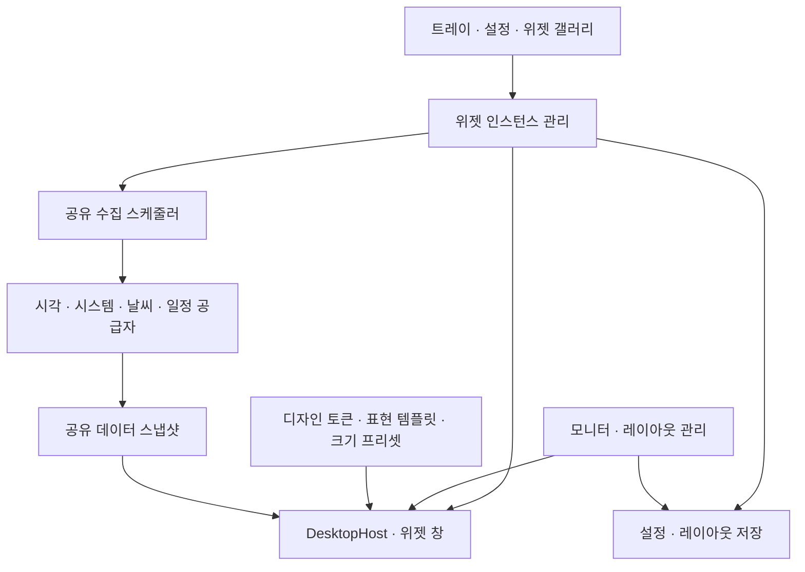
```mermaid
flowchart TB
    Manager[트레이 · 설정 · 위젯 갤러리] --> Core[위젯 인스턴스 관리]
    Core --> Host[DesktopHost · 위젯 창]
    Layout[모니터 · 레이아웃 관리] --> Host
    Theme[디자인 토큰 · 표현 템플릿 · 크기 프리셋] --> Host
    Core --> Scheduler[공유 수집 스케줄러]
    Scheduler --> Providers[시각 · 시스템 · 날씨 · 일정 공급자]
    Providers --> Snapshot[공유 데이터 스냅샷]
    Snapshot --> Host
    Core --> Store[설정 · 레이아웃 저장]
    Layout --> Store
```

- 앱은 사용자 세션당 단일 프로세스로 실행한다. 위젯별 프로세스나 웹뷰는 만들지 않는다.
- 위젯별 작은 창을 사용하되, 데이터 수집과 스케줄러는 프로세스 전체에서 공유한다. 이 구조의 메모리와 DPI 동작을 초기 실험에서 확인한다.
- 그래픽 장치·텍스트 포맷·브러시·정적 도형은 재사용하고, 변경된 위젯만 다시 그린다. 위젯의 실제 크기를 넘는 전체 화면 렌더 타깃은 만들지 않는다.
- 레이아웃은 데이터로 정의하고, 렌더러는 텍스트·도형·아이콘·그래프의 내장 표현을 그린다. 테마 변경이 수집 로직이나 네이티브 창 구조 변경으로 이어지지 않게 한다.
- 창 표시, 바탕화면 연결, 클릭 통과, DPI 관련 코드는 UI 내용과 분리한다.
- 수집은 UI 스레드 밖에서 수행한다. UI에는 최신 스냅샷만 전달하며 지연된 갱신을 무한히 쌓지 않는다.
- 실행 중인 위젯이 요구하는 공급자만 활성화한다. 마지막 구독자가 사라지면 해당 수집을 중단한다.
- 외부 플러그인 API는 아직 공개하지 않는다. 내장 위젯을 늘릴 수 있는 내부 등록 구조만 마련한다.

### 내부 데이터 경계

| 모델/인터페이스 | 역할 |
| --- | --- |
| `WidgetDefinition` | 종류, 표시 이름, 기능·설정 항목, 필요한 데이터 종류. 외형 수치는 포함하지 않음 |
| `ThemeDefinition` | 디자인 토큰, 위젯 종류별 표현 템플릿, 지원 크기 프리셋과 최소 크기 |
| `PaletteDefinition` | 위젯 종류와 독립적인 색상 ID, 배경·전경·구분선·그래프 토큰. 공통 테마 9종 |
| `AppearanceSettings` | 앱 기본 색상 테마 ID, 위젯별 재정의(null은 전체 따르기), 스타일 ID. 투명도는 별도 유지 |
| `WeatherAppearanceState` | 공급자 조건 코드의 정규화 결과, 도시의 낮·밤·일몰 상태, 데이터 신선도, 자동/고정 배경 모드 |
| `WidgetInstance` | 고유 ID, 종류, 모니터, 기준점·정수 격자 좌표, 크기 프리셋·확대 배율, 갱신 주기, 배경·전체 불투명도, 테마, 잠금·클릭 통과, 위젯별 설정 |
| `IDataProvider` | 구독·해제, 샘플 수집, 취소, 사용 가능 여부 제공 |
| `MetricSnapshot` | 값·단위·수집 시각·상태. GPU 등 장치별 값은 장치 식별자를 포함 |
| `LayoutProfile` | 이름과 위젯 인스턴스 목록, 모니터 대응 정보 |

스냅샷 상태는 `Loading`, `Ready`, `Stale`, `Unavailable`, `Error`로 구분한다. 실패·미지원·첫 샘플 대기를 0%로 표시하지 않는다. 그래프는 결측 구간을 끊어 표시한다.

## 8. 데이터 수집과 위젯별 갱신 주기

각 위젯 설정에 ‘갱신 주기’를 둔다. 저장은 인스턴스별이며 모니터나 다른 위젯의 설정을 일괄 변경하지 않는다. 아래 범위에서 선택하고, 임의의 초고속 값은 받지 않는다.

| 위젯 | 수집 방식 | 기본값 | 선택할 수 있는 갱신 주기 |
| --- | --- | --- | --- |
| 시계 | OS 시각·시간대 | 1분 | 1초 / 1분. 초 표시를 켜면 1초 |
| CPU | Windows PDH 전체 프로세서 시간 | 2초 | 1 / 2 / 5 / 10초 |
| GPU | GPU Engine 카운터·어댑터 정보 | 2초 | 1 / 2 / 5 / 10초 |
| 메모리 | Windows 메모리 상태 API | 5초 | 2 / 5 / 10 / 30 / 60초 |
| 시스템 정보 | 정적 정보 캐시 + 가동 시간 | 1분 | 30초 / 1분 / 5분. 정적 정보는 장치 변경 시 갱신 |
| 네트워크 | 선택한 어댑터의 누적 송수신량 차이 | 2초 | 1 / 2 / 5 / 10초 |
| 디스크 | 선택한 볼륨의 용량·여유 공간 | 1분 | 10초 / 30초 / 1분 / 5분 |
| 날씨 | 기상청 격자별 실황·초단기/단기예보 | 15분 | 5 / 15 / 30 / 60분. 외부 요청은 공급자 발표·수정 주기와 제한도 적용 |
| 캘린더 | 선택한 캘린더의 일정 조회 | 5분 | 1 / 5 / 15 / 30분. 미연결 로컬 달력은 날짜·월 변경 시만 갱신 |

- 같은 데이터 키의 활성 구독자는 공급자 하나를 공유한다. 예를 들어 같은 GPU를 2초와 10초로 보는 두 위젯은 2초마다 한 번 수집하고 각각 자기 표시 주기에 갱신한다.
- 수집 주기와 표시 주기를 분리한다. 빠른 수집 위젯이 삭제되면 남은 구독자에게 필요한 주기로 즉시 낮춘다. 위젯마다 독립 폴링 스레드를 만들지 않는다.
- 네트워크 속도는 실제 경과 시간으로 계산한다. 어댑터 변경·누적 카운터 초기화·절전 구간은 결측 처리한다. 시안의 Mbps는 비트/초 단위이며 MB/s와 구분한다.
- 허용되지 않은 값은 저장하지 않는다. API 요청 제한·실패 재시도·절전 정책이 적용되면 실제 주기와 갱신 지연 상태를 설정 화면에 표시한다.
- 빠른 주기를 선택하면 부하가 늘 수 있음을 설정에서 안내한다. 보이는 숫자나 그래프가 바뀌지 않으면 재렌더링을 생략한다.
- 표시·수집·실패 재시도 작업은 하나의 기한 기반 스케줄러로 합친다. 취소된 작업과 이미 실행 중인 동일 요청을 중복 예약하지 않는다.

- PDH는 언어에 독립적인 카운터 등록 방식을 사용하고 한국어·영어 Windows에서 확인한다.
- CPU의 ‘사용률’은 수집한 프로세서 시간 기준으로 정의한다. 작업 관리자의 다른 지표와 숫자가 항상 일치한다고 약속하지 않는다.
- GPU는 서로 다른 엔진 사용률을 단순 합산하지 않는다. 동일 어댑터의 같은 물리 엔진에 해당하는 프로세스 카운터를 집계한 뒤, 가장 바쁜 엔진의 사용률을 대표값으로 사용한다. 실제 카운터 매핑과 중복 여부는 초기 실험에서 검증한다.
- GPU 카운터가 없거나 드라이버가 지원하지 않으면 ‘사용량을 읽을 수 없음’을 표시한다. 내장·외장 GPU를 구분하고, 드라이버 재시작이나 장치 변경 시 목록을 갱신한다.
- 메모리는 물리 메모리의 전체 용량과 사용 가능 용량으로 계산한다. 커밋 사용량과 혼동하지 않도록 표시 이름을 정한다.
- CPU·GPU 그래프는 최근 60초의 유한 버퍼만 유지한다. 수집 간격이 바뀌면 실제 타임스탬프를 기준으로 그린다.
- 일반 권한으로 기본 위젯을 제공한다. 온도·팬 등의 추가 센서를 위해 앱 전체를 상시 관리자 권한으로 실행하는 구조는 채택하지 않는다.

GPU 대표값 설계는 [Microsoft의 GPU 사용량 설명](https://devblogs.microsoft.com/directx/gpus-in-the-task-manager/)을 참고했다. 작업 관리자와 동일한 수집 경로나 완전히 같은 값을 보장한다는 의미는 아니다.

### 날씨·시간대에 따른 자동 배경

삼성 공식 One UI 설명은 현재 날씨를 전달하는 일러스트와 시간대에 따라 바뀌는 배경색을 소개한다. Tempos는 이 원칙을 기존의 둥근 카드·큰 숫자·절제된 그라데이션에 적용한다. 아래 상태와 색상 조합은 Tempos의 자체 설계이며 삼성의 기능 명세를 그대로 옮긴 것이 아니다. [삼성 Weather 표현 안내](https://www.samsung.com/ie/one-ui/features/)

배경은 **날씨 상태 × 도시의 낮·밤**을 합성해 정한다. ‘밤’은 비·눈을 덮어쓰는 별도 날씨가 아니다. 비 오는 밤에는 어두운 비 장면, 눈 오는 밤에는 어두운 눈 장면을 표시한다.

| 표현 | 배경 방향 | 정적 장식 |
| --- | --- | --- |
| 맑은 낮 | 기존 스카이 계열 | 해와 약한 빛 띠 |
| 구름 조금·흐림 | 청색에서 회청색으로 | 상태에 맞는 구름 수·불투명도 |
| 비·이슬비·소나기 | 차분한 비색 청회색 | 구름과 소수의 빗줄기 |
| 눈·눈 소나기 | 서늘한 청색·연보라 | 구름과 소수의 눈송이 |
| 뇌우 | 짙은 인디고·회보라 | 구름·비·작은 번개 도형. 섬광 없음 |
| 안개 | 채도가 낮은 회청색 | 가느다란 수평 안개 띠 |
| 맑은 밤 | 짙은 남색·인디고 | 달과 소수의 별. 실제 달 위상으로 주장하지 않음 |
| 비·눈·안개가 있는 밤 | 해당 상태의 어두운 팔레트 | 강수·안개 장식 유지. 별은 숨김 |
| 맑은 일출·일몰 무렵 | 절제된 보라·복숭아색 | 낮은 해와 수평선. 비·눈·안개·뇌우에서는 적용하지 않음 |
| 미설정·데이터 없음 | 중립 슬레이트 또는 선택한 고정 테마 | 해·비 등 특정 날씨를 암시하는 장식 없음 |

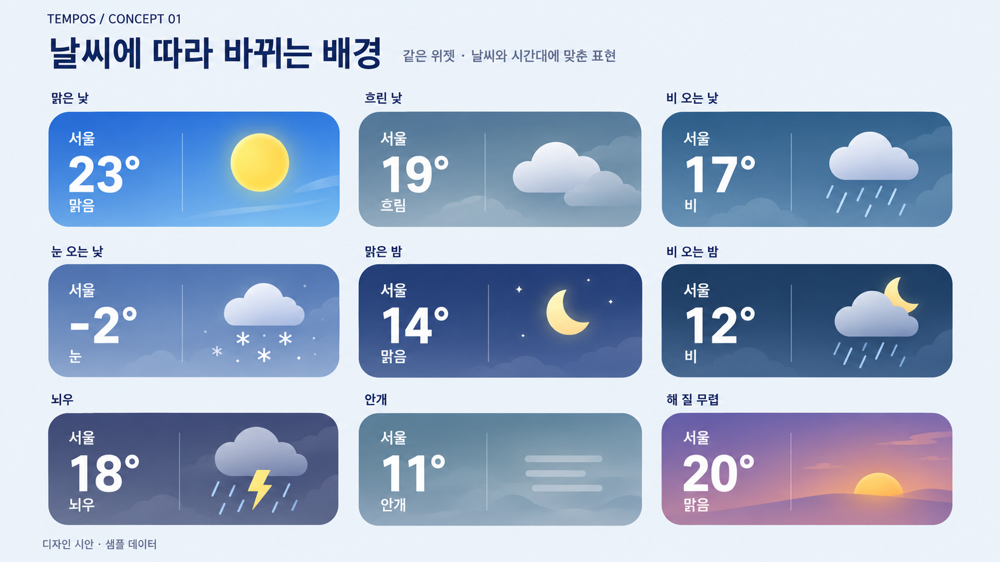

#### 데이터 판정

- 국내 기상청 경로는 실황 `PTY`와 보조 예보 `SKY` 등을 18절대로 정규화한다. 관측·예보·계산 자료의 출처와 시각을 분리한다. 안개·뇌우처럼 근거가 없는 현상을 임의 생성하지 않는다.
- 해외 확장 후보인 Open-Meteo에서는 `current.weather_code`를 정규화한다. 0·1은 맑음, 2·3은 구름, 45·48은 안개, 51~57의 정의된 이슬비 코드와 61·63·65·66·67·80·81·82는 비, 71·73·75·77·85·86은 눈, 95·96·97·99는 뇌우 계열로 묶는다. 공급자별 코드표를 섞지 않고, 표에 없는 코드는 중립 상태로 처리한다.
- 국내 경로의 낮·밤은 선택 지역 좌표와 날짜로 계산한 일출·일몰을 사용한다. 해외 확장 시에는 공급자의 유효한 `is_day`·일출/일몰을 사용할 수 있다. 고정 ‘18시 이후 밤’ 규칙은 사용하지 않는다. Open-Meteo의 `daily.weather_code`는 현재 배경 판정에 쓰지 않는다. [Open-Meteo 변수·날씨 코드](https://open-meteo.com/en/docs)
- 유효한 당일 일출·일몰 캐시가 있으면 도시 현지 시각으로 경계를 계산한다. 일출·일몰 전후 30분의 색조 변화는 맑거나 구름이 적을 때만 적용하는 디자인 규칙이다. 극지 등 경계 값이 없으면 현재 시점에 유효한 `is_day`를 사용하고, 둘 다 불명확하면 시간대 장식을 중립 처리한다.
- 외부 조회 주기는 기존 위젯 설정을 따른다. 낮·밤/일몰 경계만 공유 스케줄러에 일회성으로 예약해 배경을 다시 그리며, 배경 변경 때문에 API를 추가 호출하지 않는다. 복귀·시각 변경·도시 변경 시 예약을 다시 계산한다.
- 강수 확률만 높다는 이유로 현재 비 장면을 표시하지 않는다. 미지원 코드·시각·일출/일몰 값은 추측하지 않는다. 미래 예보는 L의 예보 영역으로 구분한다.
- 실패하면 이전 성공 정보와 갱신 지연 상태를 함께 유지한다. 아래 오류 정책에 따라 현재 값을 더 이상 표시하지 않는 시점에는 날씨 장식도 제거한다. 캐시를 새 실측처럼 표현하지 않는다.

#### 크기·투명도·성능

- S/Slim/M/L 모두 동일한 상태 판정을 공유한다. S/Slim은 색상과 핵심 아이콘 위주, M/L은 여백에만 구름·비·눈 도형을 추가한다. 큰 배경 장식 때문에 숫자·예보를 가리지 않는다.
- 단순 그라데이션·벡터 도형으로 그리며, 눈/비 입자·구름 이동·번개 깜박임·영상은 상시 재생하지 않는다. 배경은 날씨 상태·일출/일몰 경계·테마·크기 변경 때만 재평가한다. 정적 상태에서 프레임 루프를 만들지 않는다.
- 자동 배경은 위젯의 배경 투명도를 그대로 따른다. 배경 투명도 100%에서는 장식을 생략하고 글자·날씨 아이콘만 남긴다. 전체 투명도도 기존 규칙을 유지한다.
- 사용 중인 장면의 자원만 제한된 캐시에 보관한다. 날씨×팔레트×크기×DPI의 모든 조합을 미리 비트맵으로 만들거나 상주시켜 두지 않는다. 기존 9절의 CPU·메모리 예산을 그대로 적용한다.

### 날씨 오류와 서비스 범위

- 사용자가 고른 지역의 격자 또는 공급자가 요구하는 좌표만 조회에 사용한다. 위치 권한과 백그라운드 위치 추적은 초기 범위에서 제외한다.
- 현재 상태와 예보를 구분하고, 공급자가 제공한 시각과 마지막 조회 시각을 보존한다.
- 요청 전체 기한은 17절과 동일한 15초를 초기값으로 둔다. 일시 실패의 재시도는 공급자 제한과 자료 생성 시각을 반영하고 `Retry-After`가 있으면 우선한다. 키 오류·일일 한도 초과·새 발표 자료 미생성을 같은 재시도로 처리하지 않는다.
- 실패했을 때는 마지막 성공 데이터와 ‘갱신 지연’을 표시한다. 데이터가 한 번도 없거나 24시간보다 오래되었으면 현재 기온 대신 ‘날씨를 불러올 수 없음’을 표시한다.
- 도시 변경 시 다른 도시의 캐시를 잠시 보여주지 않는다. 동일 도시·요청 조건의 캐시는 여러 위젯이 공유한다.
- 기상청 자료를 표시하는 날씨 위젯에는 작은 출처 문구를 남기고, 상세 화면과 앱 정보에 원문 링크·이용 조건을 제공한다. 이 규칙은 캘린더의 Google 문구 숨김과 별개다.
- 해외 확장 후보인 Open-Meteo 무료 엔드포인트는 비상업적 사용 조건을 전제로 한다. 국내 기상청 데이터의 출처 표시 조건과 혼동하지 않는다. [Open-Meteo 공식 안내](https://open-meteo.com/en/pricing)

### 절전 정책

화면 꺼짐, 세션 잠금, 시스템 절전 시 시각·시스템 수집과 UI 갱신을 멈추고 날씨·캘린더 요청을 보류한다. 복귀 시 시각과 모니터를 다시 확인하고, 오래된 데이터만 갱신한다. 사용자가 모든 위젯을 숨긴 경우에도 불필요한 수집을 중단한다.

Windows 절전 모드에서는 CPU·GPU·네트워크 주기를 최소 5초로 완화하며 사용자가 저장한 값은 유지한다. 복귀 시 원래 주기로 돌아간다. 프레임 단위의 전역 타이머와 바쁜 대기는 사용하지 않는다.

## 9. 엄격한 성능 예산과 누수 방지

아래 수치는 **아직 실측하지 않은 초기 통과 목표**다. 목표에 맞추기 위해 측정치를 숨기거나 작업 집합을 강제로 비우지 않는다. 달성하지 못하면 원인과 측정값을 기록하고 수집·렌더링·호스트 구성을 먼저 수정한다.

기준 환경은 Windows 11, 4코어 이상, 16GB RAM, SSD, FHD 100%와 QHD 150% 모니터 2대다. Release 빌드로 시계·날씨·CPU·GPU·메모리 5개를 M 크기·확대 100%로 배치한다. 기본 갱신 주기, 시계 초 표시 꺼짐, 관리 창 닫힘, 배경 투명도 10%를 사용한다. 5분 준비 후 30분간 측정하며 정상 날씨 요청도 포함한다.

| 항목 | 통과 목표 |
| --- | --- |
| 기본 배치 CPU | 시스템 전체 기준 평균 0.1% 이하, 1초 표본 P95 0.3% 이하 |
| 코어 수와 무관한 CPU 예산 | 프로세스 CPU 시간 평균 4ms/초 이하. 위의 비율 조건도 함께 충족 |
| 기본 배치 메모리 | Private Bytes 32MiB 이하, Working Set 48MiB 이하 |
| 시계만 표시 | 초 표시를 끈 상태에서 CPU 평균 0.02% 이하, 불필요한 초 단위 깨움 없음 |
| 확장 9종 배치 | Google 일정 연동 포함, 기본 주기에서 평균 CPU 0.2% 이하, Private Bytes 48MiB·Working Set 72MiB 이하 |
| 실행·조작 | 기본 위젯 표시 2초 이내, 일반 입력 처리 지연 100ms 이내 |
| 모두 숨김·잠금 | 주기 렌더링과 관련 데이터 폴링 중단. 이벤트 대기만 유지 |
| 누수 | 앱 소유 객체·창·핸들·구독·콜백의 지속 증가 없음. 아래 반복/장시간 검증 통과 |

CPU 비율은 `프로세스 CPU 시간 / 경과 시간 / 논리 프로세서 수`로 계산하고 원시 CPU 시간도 기록한다. Private Bytes와 Working Set을 함께 보며, 네이티브 힙·GDI/USER 핸들·스레드·타이머·소켓·그래픽 자원 수도 수집한다. 측정 방식은 [Windows 메모리 분석 도구 안내](https://learn.microsoft.com/en-us/windows-hardware/test/wpt/memory-footprint-optimization)를 참고한다.

투명도와 그래픽 비용이 다른 프로세스나 GPU로 이동하지 않았는지 DWM의 CPU·메모리 및 공유/전용 GPU 메모리 변화를 앱 미실행 상태와 비교한다. 4K·200% DPI, 확대 200%, 캘린더 XL, 편집 모드, 가장 빠른 갱신 주기는 별도 부하 시나리오로 수치와 최대값을 공개한다. 기본 시나리오 목표를 모든 크기·주기에 대한 무조건적 보장으로 표현하지 않는다.

### 예산을 지키는 구현 원칙

- 렌더 루프를 상시 실행하지 않는다. 데이터·입력·창 노출·DPI 변화에 반응하고, 표시는 변경된 영역만 다시 그린다. 편집 중에도 입력이 없으면 그리지 않는다.
- 정적인 그라데이션·아이콘은 도형으로 그린다. 시안용 PNG·대형 캔버스·아이콘 후보 원본을 앱에 그대로 탑재하지 않는다.
- 공유 공급자, 제한된 스레드 풀, 유한 버퍼를 사용한다. CPU/GPU/네트워크 그래프는 최근 60초만 보관하고, 샘플 수에도 상한을 둔다.
- 텍스트·그래픽 캐시는 LRU와 명시적 바이트 상한을 둔다. 날씨·일정 파싱 결과의 합계 메모리 예산은 4MiB를 출발점으로 하며, 큰 응답은 필요한 필드만 보관한다. 제한으로 일부 일정만 읽혔다면 이를 숨기지 않고 추가 조회 안내를 표시한다.
- `unique_ptr`, COM 스마트 포인터, 핸들 RAII 래퍼로 소유자를 명시한다. 구독의 순환 참조와 파괴된 위젯을 참조하는 비동기 콜백을 막는다.
- 위젯 삭제 시 수집 구독·예약 작업·콜백·창·렌더 자원을 해제한다. 화면·테마·크기 변경 시 이전 자원을 보관하는 무제한 캐시를 만들지 않는다.
- 설정 창과 편집 오버레이는 닫을 때 해제한다. 화면 캡처, 고주기 WMI, 지속 로그 쓰기, 폴링식 창 감시는 기본 경로에 넣지 않는다.

### 누수 통과 기준

- 1,000회 위젯 추가→삭제, 테마·배율·투명도 변경, 편집 시작→종료 후 5분 안정화한다. 앱 소유 객체·구독·타이머·창 수는 기준값으로 돌아와야 한다. Private Bytes 잔여 증가는 2MiB 이내이며 반복 횟수에 비례해서 늘면 실패다.
- 고정 데이터·동일 위젯 구성으로 24시간 실행한다. 초기 캐시 준비 후 Private Bytes의 순증가는 2MiB 이내이고 지속 상승 추세가 없어야 한다. 달력 월 이동·오프라인 재시도·모니터 재연결은 별도 반복 시나리오로 확인한다.
- 종료 후 남은 앱 소유 힙 할당과 핸들을 힙 스냅샷·자원 추적으로 검사한다. 메모리 수치가 평평하다는 이유만으로 누수가 없다고 판단하지 않는다.
- 네이티브 메모리 진단과 AddressSanitizer 등으로 잘못된 해제·범위 밖 접근도 검사한다. 누수 검증과 메모리 안전성 검증은 각각 수행한다.
- 이 기준은 검증한 환경에서의 통과 조건이며, 설계 단계에서 ‘절대 누수 없음’을 보장한다는 뜻은 아니다.

## 10. 설정 저장과 배포

- 사용자 데이터는 `%LocalAppData%\Tempos` 아래에 저장한다. 설정과 레이아웃은 버전 필드가 있는 JSON, 날씨·일정 캐시는 별도 파일로 분리한다. 인증 정보와 일정 캐시는 사용자 범위 보호 저장소를 사용한다.
- 변경은 짧게 지연시켜 묶어 저장하고, 임시 파일을 통한 원자적 교체와 마지막 정상 백업을 사용한다. 드래그 중 매 프레임 디스크에 쓰지 않는다.
- 손상된 설정은 보존한 뒤 백업을 복구한다. 복구할 수 없으면 기본 배치로 시작하고 관리 화면에 안내한다.
- 모니터가 없어 생긴 임시 배치는 원래 저장된 배치를 덮어쓰지 않는다. 사용자의 명시적인 재배치는 저장한다.
- 레이아웃 내보내기·가져오기는 JSON으로 제공한다. 가져온 값의 종류·크기·좌표를 검증하며 실행 코드나 플러그인을 포함하지 않는다.
- 오류 로그는 로컬에 크기 제한을 두고 기록한다. 자동 원격 분석은 첫 버전에 넣지 않는다.
- 첫 배포는 네이티브 x64 ZIP으로 제안한다. 필요한 런타임 구성, 다운로드 크기, 실행 중 메모리 사용량을 각각 기록한다.
- 자동 업데이트와 Microsoft Store 배포는 기본 동작을 안정화한 뒤 검토한다.

## 11. 구현 단계와 완료 조건

아래 작업은 향후 구현 계획이며, 이번 설계 작업에서 실행하지 않는다.

| 단계 | 작업 | 완료 조건 |
| --- | --- | --- |
| 0. 기술 검증 | 배경형·무배경형 위젯 1개·5개·10개, 바탕화면 연결, 혼합 DPI 이동, CPU·GPU 수집 시제품 | 표현 교체, Win+D, Explorer 재시작, 입력 통과, GPU 지원 여부, 상주 비용을 실측하고 우선 기술안의 적합성을 판단 |
| 1. 위젯 기반 | 트레이, 갤러리, 시계, 토큰·표현 템플릿, 크기 프리셋, 위치 잠금 | 위젯 추가·복제·삭제와 저장·재실행 복원, 데이터 로직 수정 없는 외형 교체 가능 |
| 2. 멀티 모니터 | 화면 식별, 스냅, DPI 변환, 임시 이동과 복원 | 연결 해제·재연결·회전·배율 변경 시 배치가 손실되지 않음 |
| 3. 기본 데이터 | CPU·GPU·메모리·시스템 요약·날씨, 공유 공급자 | 정상·대기·오류·미지원 상태가 정확히 표시되고 수집이 중복되지 않음 |
| 4. 첫 버전 완성 | 레이아웃 저장, 접근성, 절전, 설정 복구, 배포 | 주요 시나리오와 성능 목표를 검증하고 실측 결과를 기록 |
| 5. 확장 | 네트워크·디스크·조회 전용 캘린더, XL 월간형 | 계정 연결·오류 상태·날짜 표시와 확장 배치의 성능 예산 검증 |

0단계에서 바탕화면 고정이나 투명 창 성능이 요구사항을 만족하지 못하면 위젯 종류를 늘리지 않고 호스트·렌더링 선택을 재검토한다. 미검증 상태로 다음 단계의 완료를 선언하지 않는다.

## 12. 검증 시나리오

### 개발 단계별 E2E와 완료 판단

**현재는 테스트 설계만 작성한다.** 아래 실행 절차는 사용자가 별도로 개발 시작을 지시한 뒤 적용한다. 설계 문서 작성이나 시안 검토를 앱 실행 테스트 완료로 기록하지 않는다.

1. 각 개발 단계에 들어갈 때 사용자 동작, 기대 결과, 필요한 환경을 먼저 정한다. 11절의 각 단계가 검증 단위이며, 중간에 독립적인 기능을 완성한 경우에도 해당 기능의 E2E를 수행한다.
2. 구현 후 실제 Windows 앱을 실행해 사용자 경로를 검증한다. 내부 함수를 호출하는 단위 테스트만으로 E2E를 대체하지 않는다. 일반 UI 조작, 창·트레이 상태, 저장 결과와 재실행 복원을 함께 확인한다.
3. 실패하면 원인을 수정하고 실패 시나리오 및 영향을 받은 기존 흐름을 다시 실행한다. 테스트를 끄거나 기대 결과를 낮춰 통과시키지 않는다.
4. 단계별 결과에는 빌드 식별자, Windows 빌드, 모니터·DPI 구성, 시나리오, 통과/실패, 재현 절차와 필요한 캡처·로그를 남긴다. 계정 토큰과 개인 일정은 기록하지 않는다.
5. 기능 E2E가 통과하면 성능·자원 해제 검증까지 진행한다. 이미 통과한 테스트는 새 변경이나 실패 근거가 있을 때 다시 실행한다. 최종 배포 후보에서는 아래 필수 흐름을 한 번에 회귀 검증한다.
6. 필요한 수정과 재검증은 매번 진행 허락을 묻지 않고 이어 간다. 계정 인증·외부 자격 정보처럼 사용자만 제공할 수 있는 항목은 분리해서 기록하고, 독립적으로 진행 가능한 작업은 계속한다.

| 검증 단계 | 실제 앱에서 확인할 주요 흐름 | 통과 증거 |
| --- | --- | --- |
| 실행·트레이 | 첫 실행, 관리 창 닫기, 트레이에서 다시 열기, 전체 숨김/표시, 중복 실행, 종료 | 위젯 유지, 앱당 아이콘 1개, 종료 후 앱 자원 정리 |
| 위젯 조작 | 9종 추가·복제·삭제, S/Slim/M/L 및 캘린더 XL 선택, 배율·비율 고정 | 지원 규격 적용, 중복 없는 배치, 재실행 시 설정 복원 |
| 그리드·모니터 | 이동·스냅·충돌·화면 경계, 다른 모니터로 이동, DPI 변경, 분리·재연결 | 비율 유지, 화면 밖 유실 방지, 원래 배치 복원 |
| 표시 설정 | 전체 테마, 위젯별 재정의, 배경/전체 투명도, 완전 투명 후 편집 복귀 | 해당 인스턴스에만 적용, 가독성과 복구 경로 유지 |
| 데이터·주기 | 위젯별 갱신 주기, 공유 수집, 미지원 GPU, 오프라인·복귀 | 중복 수집 없음, 오류를 0으로 표시하지 않음, 복귀 후 정상 갱신 |
| 날씨 | 상태별 배경, 비/눈과 밤의 조합, 일출·일몰, 도시 변경·실패 | 올바른 상태 표현, API 추가 호출과 상시 렌더 루프 없음 |
| 캘린더 | 계정 미연결 달력, 조회 연동, 월 이동·종일·다일·반복 일정, 연결 해제 | 추가·수정·삭제·참석 응답 경로 없음, 서비스 문구는 설정에만 표시 |
| 저장·복구 | 저장 후 재실행, 손상 설정, 레이아웃 내보내기/가져오기, 셸 복구 | 설정 유실 방지, 인증 정보의 내보내기 제외, 아이콘·창 복구 |
| 성능·안정성 | 기본/확장 배치 측정, 1,000회 생성·해제, 24시간 실행 | 9절의 CPU·메모리·누수 기준과 측정 기록 |

- E2E는 Windows 데스크톱 UI 자동화를 기본으로 설계한다. 사용하는 자동화 도구는 0단계 기술 검증에서 네이티브 컨트롤·사용자 지정 위젯·트레이 접근 가능 여부를 확인하고 선정한다.
- 제어된 날씨·일정 응답으로 재현 가능한 테스트와 실제 외부 서비스 연결 테스트를 구분한다. 모의 응답 통과를 실제 Google 계정 연동 성공으로 보고하지 않는다. 현재 OAuth 클라이언트는 준비되지 않았으므로, 설정 입력 경로와 조회 전용 권한 검증을 설계하고 실제 연결 검증은 자격 정보 준비 후 수행한다.
- 사용자 레이아웃과 토큰을 덮어쓰지 않도록 테스트 데이터 경로를 분리한다. Explorer 재시작·로그아웃·모니터 연결 변경처럼 작업 환경을 흔드는 시험은 격리된 테스트 세션 또는 전용 환경에서 수행한다.
- **완료는 필수 기능 E2E, 회귀 검증, 성능·누수 기준, 배포본 실행 검증을 충족하고 증거를 남겼을 때만 선언한다.** 확보하지 못한 장치·환경·실계정 검증은 ‘미검증’으로 기록하며 통과로 간주하지 않는다. 24시간 시험을 짧은 실행으로 대신하지 않는다.

### 자동 검증 대상

- 위치 저장→로드, 음수 좌표, 서로 다른 DPI, 작업 영역 보정, 동일 모니터 재연결과 사용자 재배치의 우선순위.
- 위젯을 여러 개 추가해도 같은 공급자는 한 번만 수집하고, 마지막 위젯 삭제 시 작업이 종료되는지 확인.
- 맑음·구름·비·눈·뇌우·안개와 낮·밤 조합, 시간대·DST·일출/일몰·극지·알 수 없는 날씨 코드를 검증. 일출/일몰 경계 변경에 추가 API 호출·프레임 루프가 생기지 않는지 확인.
- 공통 테마 9종의 전체 적용·개별 재정의·재정의 해제·저장 복원과 날씨 자동/고정 모드를 확인. 테마 변경이 위치·비율·투명도·캘린더 일정 색을 바꾸거나 수집을 재시작하지 않는지 확인.
- 서로 다른 갱신 주기, 주기 변경·구독 해제, API 백오프와 절전 복귀에서 중복 작업이 생기지 않는지 확인.
- 모든 프리셋의 100·150·200% 크기에서 가로·세로 비율, 4 DIP 격자, 충돌·화면 경계 처리와 저장 복원을 확인.
- 배경·전체 투명도와 클릭 통과가 독립적으로 동작하고, 완전 투명 위젯도 편집 모드에서 복구 가능한지 확인.
- 캘린더 어댑터에 쓰기 API가 없고 조회 권한만 요청하는지 확인. 월 경계·윤년·DST·종일·반복·취소 일정·권한 상실·오프라인을 검증.
- 테마·표현 변경 시 데이터·위젯 설정·모니터 소속이 유지되고, 해당 표현이 없는 위젯은 기본 표현으로 표시되는지 확인.
- CPU·GPU의 첫 샘플, 미지원 카운터, 결측 구간, 여러 GPU·엔진 집계. 오류가 0%로 바뀌지 않는지 확인.
- 날씨 응답 정상·시간 초과·요청 제한·잘못된 응답·오프라인·도시 변경·오래된 캐시.
- 설정 저장 중 중단, 손상된 JSON, 백업 복구, 이전 설정 버전 처리.
- 절전·시각 변경 후 갱신과 타이머 중복 방지. 시간 경과 측정은 벽시계 변경에 영향을 받지 않게 확인.

### Windows에서 직접 검증할 대상

- 모니터 1·2·3대, FHD·QHD·4K 혼합, 100·125·150·200% 배율, 좌우·상하·세로 배치.
- 모니터 분리·재연결, 주 모니터 변경, 도킹, 복제 모드, Explorer 재시작, 절전 복귀.
- Win+D, Alt+Tab, 전체 화면 앱, 바탕화면 아이콘 선택, 클릭 통과와 트레이를 통한 편집 복귀.
- 트레이 아이콘 1개 유지, 숨겨진 아이콘/상시 표시 사용자 설정 존중, 관리 창 닫기·앱 종료의 구분, Explorer 재시작·혼합 DPI에서 아이콘 복구, 등록 실패·중복 실행·키보드 접근.
- NVIDIA·AMD·Intel의 확보 가능한 실제 장치에서 GPU 수집 검증. 시험하지 못한 조합을 지원 검증 완료로 표기하지 않음.
- 밝고 어두운 배경화면, 긴 도시·장치 이름, 한국어·영어, 고대비·모션 감소, 키보드와 스크린 리더의 관리 화면 접근.
- Release 빌드의 기본·확장 성능 예산, 24시간 실행과 1,000회 생성/해제 검증. 잔여 타이머·구독·창·핸들이 정리되는지 확인.

첫 버전의 성공 기준은 **기본 6종 위젯을 쉽게 배치할 수 있고, 여러 모니터에서 배치를 유지하며, 측정 가능한 낮은 상주 비용으로 사용할 수 있는 것**이다.

## 13. 캘린더 조회 전용 연동과 월간형

### 사용자에게 보이는 범위

- 계정을 연결하지 않아도 날짜 달력은 동작한다. 설정의 ‘캘린더 연동’에서만 Google 계정을 연결하고 표시할 캘린더를 선택한다. 초기에는 계정 1개와 그 계정에서 읽을 수 있는 여러 캘린더를 지원한다.
- 위젯에는 날짜, 일정 시간·제목, 캘린더별 색만 표시한다. Google/Google Calendar/구글 문구, 계정 이름, 연결 여부, 동기화 시각은 위젯에 넣지 않는다.
- 연결·새로 고침·오프라인·권한 만료·연결 해제 관리는 설정 화면에 둔다. 일정 데이터가 오래됐을 때는 위젯에 서비스 이름 없는 작은 상태 아이콘만 표시하고, 상세 이유는 설정에서 확인한다.
- **일정 추가·수정·삭제·이동·참석 응답 기능은 어떤 위젯 크기에서도 제공하지 않는다.** 내부 어댑터에도 쓰기 메서드를 만들지 않는다.
- 필요하면 설정의 ‘원본 캘린더 열기’로 시스템 브라우저를 연다. 앱이 일정 변경 요청을 대신 수행하지 않는다. 표시할 캘린더와 색상 필터를 고르는 것은 Tempos 로컬 표시 설정만 변경한다.

### 인증과 조회

- Google Calendar API를 사용하는 Desktop OAuth 클라이언트로 시스템 브라우저 로그인, PKCE S256, state 검증, 일회성 loopback 응답 수신을 사용한다. 인증 후 리스너를 닫는다. [Google의 데스크톱 OAuth 안내](https://developers.google.com/identity/protocols/oauth2/native-app)
- Calendar 권한은 `calendar.calendarlist.readonly`와 `calendar.events.readonly`만 요청한다. `calendar`, `calendar.events`, `calendar.calendarlist` 등의 쓰기 권한은 요청하지 않는다. [Calendar API 권한 목록](https://developers.google.com/workspace/calendar/api/auth)
- Calendar API 어댑터는 캘린더 목록·일정 목록 조회만 노출한다. 날짜 조회에는 `events.list`의 `timeMin`, `timeMax`, `singleEvents=true`, `orderBy=startTime`과 페이지 처리를 사용한다. 읽는 기간은 활성 위젯에 필요한 오늘 하루, 인접 월 날짜를 포함한 월간 그리드 전체, 다음 14일 범위로 제한한다. [Events.list 문서](https://developers.google.com/workspace/calendar/api/v3/reference/events/list)
- 첫 구현은 기간 제한 조회와 캐시 교체를 사용한다. `syncToken`을 기간 필터와 섞지 않는다. 같은 계정·캘린더·기간의 여러 위젯은 요청과 캐시를 공유하며, 겹치는 기간은 합친다.
- 백그라운드 조회는 기본 5분, 최소 1분이다. 동시 요청 수를 제한하고 403 요청 제한·429·일시 오류에는 지수 백오프와 지터를 적용한다. 권한 오류는 재연결 안내로 구분한다. [사용량 제한 안내](https://developers.google.com/workspace/calendar/api/guides/quota)
- 외부 변경과 삭제는 다음 성공 조회에서 반영한다. 실패한 조회나 미완료 페이지를 ‘일정 없음’으로 처리하지 않는다. 이전 결과를 보존하고 상태를 표시한다.
- 시간 있는 일정은 위젯 시간대로 변환하고, 종일 일정의 날짜 및 종료일 배타 규칙은 보존한다. 반복 일정의 예외·취소, DST, 다일 일정과 제한된 공개 범위를 처리한다. API가 제공하지 않은 비공개 제목을 추정하지 않는다.
- 토큰은 Windows 사용자 범위 보호 저장소에 저장하며 설정 JSON·로그·레이아웃 내보내기에 포함하지 않는다. 일정 캐시도 사용자별로 보호하고, 연결 해제 시 로컬 토큰·일정 캐시를 지운다.
- 배포 시 OAuth 프로젝트·동의 화면과 필요한 검증을 준비한다. 실제 계정 연결과 API 호출은 구현 단계 작업이며 현재는 설계만 작성한다.

### XL 월간형

- 사용자가 첨부한 월간 달력의 7열 날짜 칸과 일정 배치를 참고한다. 외형은 기존 캘린더 S/Slim/M/L과 동일한 보라색 그라데이션·흰 글자·반투명 구분선으로 통일하며, 월간형만 별도의 어두운 테마로 만들지 않는다. 기존 S/Slim/M/L은 유지한다.
- 기준 규격은 **1008×840 DIP, 비율 6:5**다. 100%·150%·200%의 고정 비율 확대와 동일한 그리드 규칙을 적용한다. 대상 모니터에 들어가지 않는 배율은 선택할 수 없다.
- 월에 따라 4~6주 행을 계산하며, 이전·다음 달 날짜를 흐리게 표시한다. 오늘은 작은 원으로 강조한다.
- 종일 일정은 색상 막대, 시간 일정은 색 점·시간·제목으로 표시한다. 다일 일정은 주 경계마다 나눠 이어 표시한다. 넘치는 일정은 ‘+N개’로 요약하고 클릭 시 조회 전용 목록을 연다.
- 입력은 이전/다음 월, 오늘로 이동, 날짜 선택, 일정 상세 조회만 허용한다. 일정의 드래그 이동이나 크기 조절 핸들은 제공하지 않는다. 위젯 전체 이동·크기 조절은 Tempos 편집 모드에서만 동작한다.
- 첨부 화면의 개인 일정과 이름은 시안에 복제하지 않는다. 샘플 일정으로 배치와 색상만 검토한다. 음력 표시는 이번 범위에 포함하지 않는다.

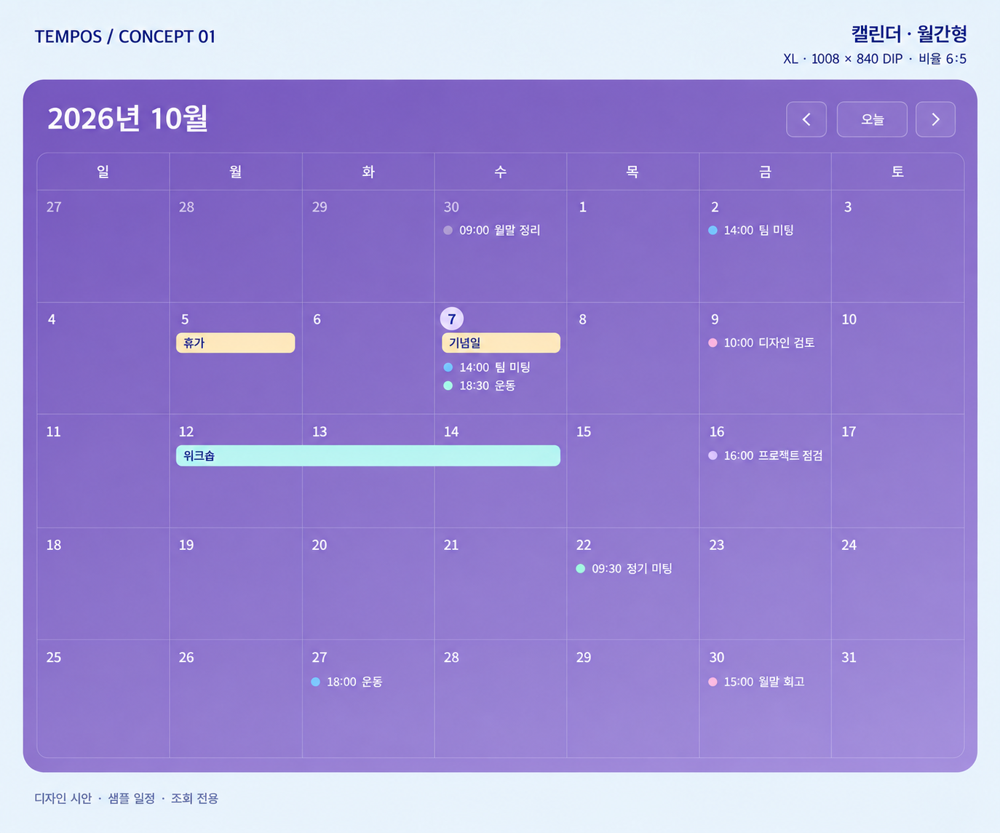

월간형도 기존 캘린더의 색상·모서리·글꼴·구분선 토큰을 공유한다. 같은 테마를 선택한 S~XL은 같은 색상 계열로 표시한다. 전체 테마 변경 시 전체 따르기 상태인 캘린더만 갱신하며 개별 지정은 유지한다. 초기 어두운 시안은 현재 후보에서 교체했다. [월간형 생성·수정 프롬프트](design/galaxy-v1/prompts-monthly.json)

## 14. 배치와 위젯 설정 시안

### 모니터별 그리드 편집

모니터를 선택해 독립된 작업 영역에서 위젯을 정렬한다. 선택한 위젯의 모서리 핸들로 비율을 유지해서 확대하고, 편집을 끝내면 격자가 숨겨진다. 그리드 정렬과 비율 고정은 항상 적용하며, 사용자가 끄는 옵션으로 제공하지 않는다.

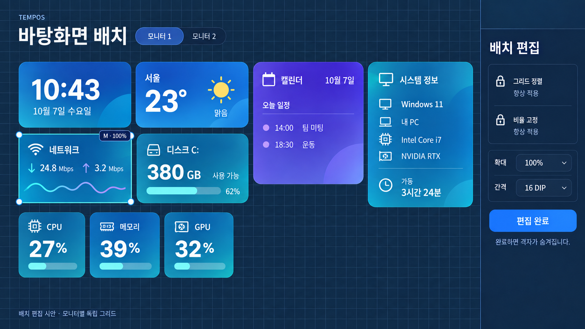

### 인스턴스별 설정

형태·확대·갱신 주기·배경 투명도·전체 투명도를 한 화면에서 미리 본다. 아래 시안의 네트워크는 M/100%/2초, 배경 투명도 20%/전체 투명도 0%의 예시다. 기본값과 선택 범위는 4·8절을 따른다. 캘린더 계정 연결·조회 대상·동기화 상태는 별도의 설정 항목에만 둔다.

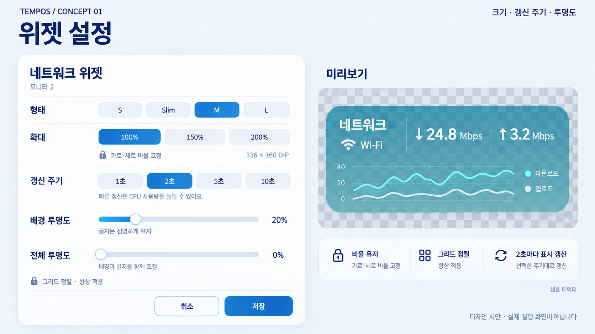

두 이미지는 조작과 배치를 검토하는 정적 시안이다. 실제 구현의 크기 계산·스냅·최종 비율은 이 문서의 규격을 따른다. [배치·설정 생성 프롬프트](design/galaxy-v1/prompts-layout.json)

## 15. 확정 앱 아이콘과 검토 이력

**2026-10-07 사용자 선택: 4번 ‘시스템 모니터’로 확정.** 둥근 파란 그라데이션 카드, 흰 모니터·그래프, 노란 끝점을 앱의 대표 형태로 사용한다. 확정 원본은 [04-pulse.png](design/app-icons/04-pulse.png)다. 나머지 4개는 검토 이력으로 보관하며 선택 후보로 다시 제안하지 않는다. 현재는 설계 단계로 앱에 적용한 상태는 아니다.

| 번호 | 후보 | 의도 | 파일 |
| --- | --- | --- | --- |
| 1 | 시계 | 시간·날씨를 함께 연상시키는 시계와 노란 점 | [시계](design/app-icons/01-clock.png) |
| 2 | 위젯 그리드 | 서로 다른 크기의 카드를 정렬한 구성 | [위젯 그리드](design/app-icons/02-grid.png) |
| 3 | T 모노그램 | Tempos 이름을 단순한 T 형태로 표현 | [T 모노그램](design/app-icons/03-monogram.png) |
| **4 · 확정** | **시스템 모니터** | 모니터와 완만한 그래프로 상태 표시를 표현 | [확정 아이콘](design/app-icons/04-pulse.png) |
| 5 | 겹친 패널 | 여러 위젯과 시계를 겹친 카드로 표현 | [겹친 패널](design/app-icons/05-panels.png) |

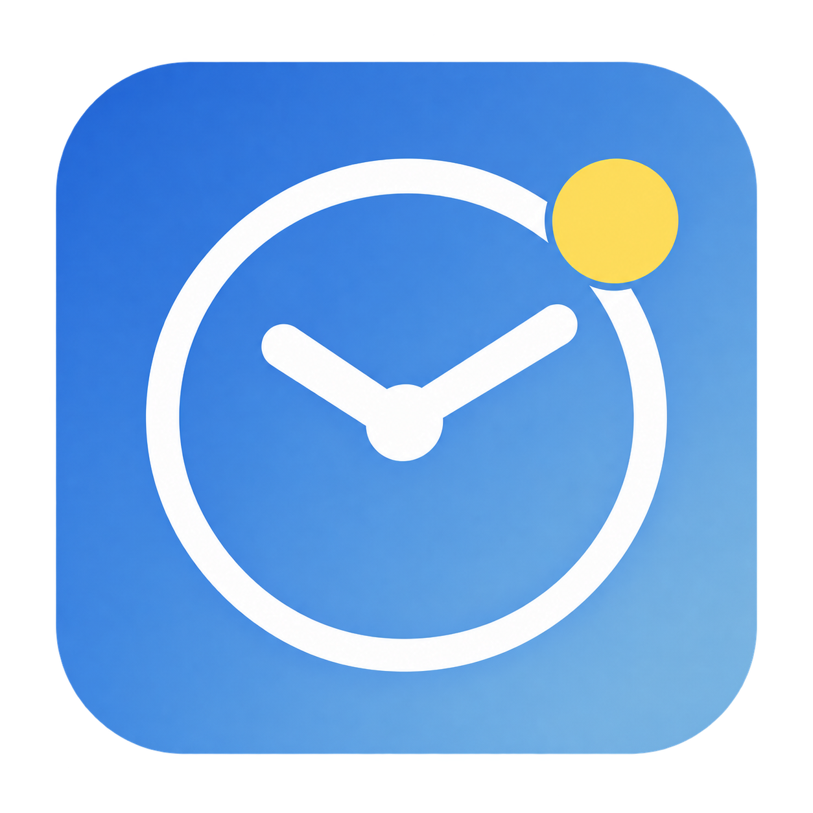

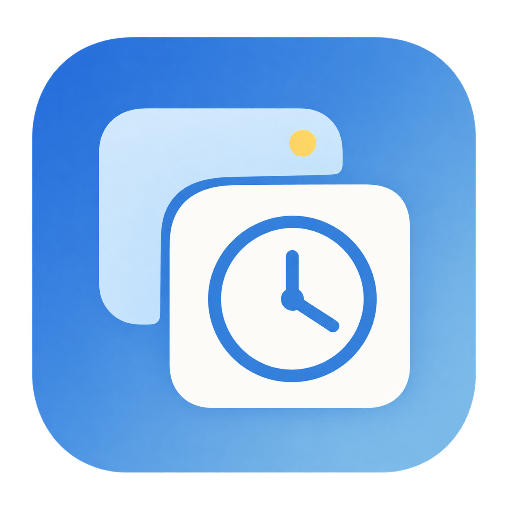

후속 배포 자산 제작에서는 확정 형태를 유지하며 작은 크기의 식별성, 외곽 알파 경계, 광학 중심과 여백을 다듬고 16·24·32·48·256px 및 ICO를 준비한다. 트레이에서는 같은 모니터·그래프 형태의 선과 여백을 작은 크기에 맞춘다. 지금은 확정 원본과 선택 기록을 보관한다. [아이콘 생성 프롬프트·파일 목록·확정 상태](design/app-icons/prompts.json)

날씨 상태와 공통 테마 비교판도 내장 `image_gen`으로 제작했다. [날씨·테마 시안 프롬프트](design/galaxy-v1/prompts-weather-themes.json)

## 16. 위젯별 상세 개발 검토

검토일: 2026-10-07. **설계 검토 결과이며 구현·실기기 검증 완료가 아니다.** 대상은 시계·날씨·CPU·GPU·메모리·시스템 정보·네트워크·디스크·캘린더 9종이다. 제외한 배터리·집중 타이머·메모/체크리스트를 다시 포함하지 않는다. 아래 규칙은 앞 절의 개요를 구체화하며, 향후 개발 단계의 인수 기준으로 사용한다.

### 16.1 먼저 해결할 공통 문제

| 우선순위 | 검토에서 확인한 문제 | 설계 결정 및 검증할 사항 |
| --- | --- | --- |
| 높음 | GPU 카운터 수집 비용·엔진 중복·장치 식별이 미검증 | 0단계에서 실제 장치별 정확도와 비용을 검증. 조용히 3D 엔진 하나로 대체하지 않음 |
| 높음 | 사용자 지정으로 그린 화면은 자동화 도구가 내용을 읽지 못할 수 있음 | UI Automation 공급자를 공통 호스트 요구사항으로 포함. 픽셀 좌표만으로 E2E를 구성하지 않음 |
| 높음 | XL·고배율 투명 창은 작은 기본 위젯보다 그래픽 메모리를 크게 사용 | 렌더 타깃 수·크기·DWM/GPU 비용을 측정. 모든 배율에서 기본 32MiB 예산을 달성했다고 주장하지 않음 |
| 높음 | Google 실연동 자격 정보가 아직 없음 | 설정 입력·미연결 달력·모의 응답 검증을 먼저 설계하고 실계정 시험은 별도 완료 항목으로 유지 |
| 중간 | 갱신 간격이 다른 위젯에서 그래프·평균값의 의미가 달라질 수 있음 | 공급자별 시간 기반 60초 기록을 공유하고 표시 시점만 인스턴스별로 조절 |
| 중간 | 디스크 전체 여유와 사용자가 쓸 수 있는 여유가 다를 수 있음 | 실제 볼륨 용량과 사용자 가용 용량을 분리하고 할당량을 전체 사용량으로 오인하지 않음 |
| 중간 | 달력 월 경계에 보이는 이웃 달의 일정 누락 가능 | 숫자상 월 범위가 아닌 실제 표시하는 4~6주 그리드 전체를 조회 |
| 중간 | 시간대와 장치 ID를 표시 문자열만으로 저장하면 복원 오류 발생 | 안정적인 식별 키와 표시 이름을 분리하고 불명확한 재연결은 재선택 상태로 처리 |

예를 들어 XL 1008×840의 단일 32비트 표면은 100% 크기·100% DPI에서 약 3.23MiB다. 위젯 확대 200%와 DPI 200%가 겹치면 4032×3360픽셀이 되어 표면 하나만 약 51.68MiB다. 이는 `너비×높이×4` 산술 예시이며 실제 메모리 측정치가 아니다. 이중 버퍼·텍스트 캐시·DWM 비용을 더해야 하므로 XL을 기본 5개 배치와 분리해 검증한다. 시안 PNG를 그대로 큰 비트맵으로 상주시키지 않는다.

### 16.2 모든 위젯이 지킬 데이터·표시 계약

- 공통 스냅샷에 데이터 키, 수집 완료 시각(UTC), 유효 시각/구간, 단조 시간 기반 순서, 상태, 단위, 변경 세대를 둔다. 표시 문자열만 저장하거나 그래프 원본으로 사용하지 않는다.
- 장치·도시·계정·선택 캘린더가 바뀌면 세대를 바꾸고 이전 비동기 응답을 폐기한다. 위젯을 삭제한 뒤 늦게 도착한 응답이 창을 다시 만들거나 해제된 객체를 참조하지 않게 한다.
- UI는 불변 스냅샷을 읽고 값이 바뀐 영역만 갱신한다. 값과 단위·그래프·상태가 서로 다른 샘플에서 섞여 표시되지 않게 한 번에 교체한다.
- `Loading`은 ‘—/불러오는 중’, `Unavailable`은 ‘지원 안 됨/장치 없음’, `Error`는 실패, `Stale`은 마지막 값과 지연 표시로 구분한다. 성공한 수치 0과 데이터 없음을 구분한다. 캘린더의 연결·오류 상세는 설정에만 두는 예외를 유지한다.
- 로컬 지표는 활성 상태에서 유효 샘플이 유효 주기의 2배와 5초 중 큰 시간을 넘겨 도착하지 않으면 지연 상태로 전환한다. 절전·숨김으로 의도적으로 중단된 상태와 구분한다. 외부 API는 해당 공급자의 캐시·백오프 규칙을 따른다.
- CPU·GPU·네트워크는 데이터 키마다 최근 60초와 경계 계산용 1개 샘플만 보관한다. 최소 주기 1초 기준 경계 샘플 포함 최대 61개로 제한하고, 최근 창 밖의 불필요한 기록은 제거한다. 장치마다 공유하며 위젯마다 복사하지 않는다.
- 평균은 최근 60초 창에 겹치는 유효 구간 길이로 가중하고, 최대는 겹치는 실제 유효 샘플의 최대값이다. 초기 60초 미만은 ‘최근 N초’로 표시한다. 숨김·절전·오류 구간은 선을 끊고 0이나 임의 보간으로 채우지 않는다. 그래프는 고정 주기로 미끄러지는 애니메이션을 하지 않는다.
- 2초/10초 위젯이 같은 CPU를 보면 수집은 2초 한 번, 두 위젯의 표시만 각각 2초/10초로 갱신한다. 같은 표시 시점의 60초 통계는 같은 원본을 사용한다. 가장 빠른 구독이 사라지면 수집 주기도 낮춘다.
- 백분율은 0~100 범위와 유효성을 검증하고 기본 표시는 정수다. 정상적인 미세 반올림 오차와 잘못된 값은 구분한다. 명백히 잘못된 큰 값을 단순 clamp로 숨기지 않는다.
- 물리 메모리는 MiB/GiB(1024 기준), 디스크는 기본 GB/TB(1000 기준), 네트워크는 기본 Mbps(비트/초)를 명확히 표기한다. 값은 원시 바이트로 보관하며 단위 전환은 표시 단계에서 수행한다. 기존 이미지의 단위 글자는 구현 규격보다 우선하지 않는다.
- 숫자·단위는 항상 함께 남긴다. 긴 이름은 줄 수 제한과 말줄임을 사용하고 전체 이름은 상세/설정에서 볼 수 있게 한다. 100% 기준 보조 글자 12 DIP를 출발점으로 삼고 작은 위젯에 맞추려고 계속 축소하지 않는다. 들어가지 않으면 보조 항목을 생략한다.
- 원격 텍스트·장치명은 길이를 제한한 일반 텍스트로 표시한다. HTML·스크립트·이미지 URL을 그대로 렌더링하거나 자동 다운로드하지 않는다.
- 관리 UI는 표준 접근성 컨트롤을 우선 사용한다. 사용자 지정 위젯은 이름·상태·값·단위·지원 조작을 UI Automation에 노출하고, 캘린더 날짜/이동/상세는 키보드로 접근 가능하게 한다. 사용자 지정 컨트롤의 공급자는 별도 구현이 필요하다. [Microsoft UI Automation 공급자](https://learn.microsoft.com/en-us/windows/win32/winauto/uiauto-providersoverview)

### 16.3 시계·날짜

**개발 판단: 낮은 난도.** 데이터 비용이 가장 작으므로 호스트·그리드·테마·투명도·시간 경계 검증을 시작하는 위젯으로 적합하다.

| 구분 | 상세 계약 |
| --- | --- |
| 데이터 | 현재 UTC, Windows 시간대 ID 또는 시스템 시간대 따르기, 현지 날짜·요일, 12/24시간제, 초 표시 |
| S / Slim | S는 시각과 날짜, Slim은 시각·짧은 날짜 한 줄. 초 표시 시 보조 날짜부터 줄이고 주 시각은 유지 |
| M / L | M은 디지털과 작은 아날로그, L은 아날로그·디지털·전체 날짜·시간대. 둘은 반드시 같은 시각 스냅샷 사용 |
| 설정 | 시스템 시간대/지정 시간대, 12/24시간, 초 켜기, 날짜 형식. 시간대 ID와 사용자 라벨을 별도 저장 |
| 갱신 | 기본 1분, 초 표시 시 1초. 초침도 1초 단위이며 부드러운 초침 애니메이션 없음 |
| 사용자 동작 | 일반 화면은 표시 전용. 시각을 클릭해 OS 시각을 바꾸는 기능 없음 |

- 타이머 콜백마다 숫자를 1씩 더하지 않는다. 실제 UTC를 다시 읽고 다음 초/분 경계에 예약해 콜백 지연과 누적 오차를 막는다. OS 시각·시간대 변경, 자정, 절전 복귀 시 즉시 재계산한다.
- 각 날짜에 맞는 DST 규칙으로 UTC를 현지 시각으로 변환한다. 표시 시각에는 벽시계, 속도 계산에는 단조 시간을 사용한다. [Windows 시간대 변환](https://learn.microsoft.com/en-us/windows/win32/api/timezoneapi/nf-timezoneapi-systemtimetotzspecificlocaltimeex), [단조 시간과 QPC](https://learn.microsoft.com/en-us/windows/win32/sysinfo/acquiring-high-resolution-time-stamps)
- 아날로그 초침은 초 표시가 꺼지면 그리지 않는다. L이라는 이유로 60fps 루프를 만들지 않는다. 여러 시간대도 하나의 UTC 공급자를 공유한다.
- **E2E CLOCK-01~04:** 23:59→다음 날짜/월/년 및 윤일, 12시간제 정오·자정, DST 전환 지역의 봄/가을, 절전 중 경과 후 복귀를 검증한다. 초 표시 해제 후 초 단위 예약이 제거되고, 다른 시간대 위젯을 추가해도 주기 수집이 중복되지 않아야 한다.

### 16.4 날씨

**개발 판단: 중상 난도.** 배경 장식보다 도시 선택·시간대·캐시·실패 처리가 더 중요하다. 현재 상태와 예보의 의미를 분리해야 한다.

| 구분 | 상세 계약 |
| --- | --- |
| 데이터 | 지역 식별자·격자·좌표·시간대, 실황 기온·강수형태, 하늘/시간별 예보, 당일 최고/최저, 일출/일몰 계산값, 필드별 공급자·발표/유효/조회 시각 |
| S / Slim | 현재 기온·상태·도시를 우선한다. 최고/최저는 공간이 허용될 때만 표시. 긴 도시명은 지역 상세를 설정으로 이동 |
| M / L | M은 현재 상태와 큰 아이콘. L은 현재 정보와 향후 4개 시간 슬롯. 없는 예보 행은 ‘—’로 표시 |
| 설정 | 기상청 인증키, 국내 지역 검색/선택, 섭씨/화씨, 자동 배경/고정 테마, 5/15/30/60분. 키/지역 미설정이면 설정 안내 |
| 갱신 | 기본 15분. 같은 격자·공급자·자료 종류는 공유하며 발표·수정 주기에 맞춰 요청. 단위/테마 차이로 별도 조회하지 않음 |
| 사용자 동작 | 읽기 전용 상세에서 데이터 기준 시각·예보·출처 확인. 도시·단위·수동 갱신은 설정에서 관리 |

- 국내 지역 검색은 공식 지역-격자표를 앱에 맞는 작은 정적 인덱스로 변환해 로컬에서 수행한다. 시도·시군구·읍면동을 함께 보여 같은 지명을 구분한다. 해외 확장을 선택할 때만 [Open-Meteo 도시 검색](https://open-meteo.com/en/docs/geocoding-api)을 검토한다.
- S만 있어도 실황·하늘 예보·당일 최고/최저가 필요하므로 자료 종류별 조회를 공유한다. L은 수신한 예보에서 다음 4개 슬롯을 재사용한다. 전체 전국 격자를 받지 않고 선택한 격자만 조회하며 필요한 값만 보관한다.
- ‘다음 4시간’은 도시 현지 기준 다음 정시부터 4개의 시간 슬롯으로 정의한다. DST로 같은 시각이 반복되면 필요 시 UTC 오프셋을 보조 표기하고, 데이터 없는 시간을 자동으로 복제하지 않는다.
- 자동 배경은 8절의 상태×낮/밤을 따른다. 도시 A 요청 후 B로 바꾸면 A 응답을 폐기한다. 수동 갱신도 요청 병합·서비스 제한·백오프를 우회하지 못한다.
- 정해진 다음 갱신이 실패하면 이전 유효 값을 지연 상태로 표시하고, 마지막 데이터가 24시간을 넘으면 현재 값과 날씨 장식을 제거한다. ‘현재’는 공급자의 해당 시점 자료이며 앱이 직접 관측한 값으로 표현하지 않는다.
- 시간별 문장은 확실한 예보 규칙에서만 만든다. 초기 구현은 검증하기 쉬운 상태 문구를 우선하고 생성형 요약 서비스를 추가하지 않는다. 공휴일·미세먼지 등 별도 공급자는 섞지 않는다.
- **E2E WEATHER-01~05:** 지역·키 설정→재실행, 지역 변경 응답 순서 역전, 비/눈/일출 경계, 타임아웃·호출 제한·오래된 캐시, S+L의 자료별 공유 조회를 검증한다. 18절의 발표 전후·동일 발표 자료 수정·당일 최저 누락·결측 코드·출처 표시 시험을 추가한다. 장식만으로 주기 깨움이 증가하면 실패다.

### 16.5 CPU

**개발 판단: 중간 난도.** 계산 자체보다 PDH 첫 샘플·사용률 정의·공유 기록·코어 수에 따른 검증이 핵심이다.

| 구분 | 상세 계약 |
| --- | --- |
| 데이터 | 시스템 전체 프로세서 시간 기준 사용률, 샘플 구간, 최근 60초 기록. CPU 모델명은 정적 시스템 정보 재사용 |
| S / Slim | S는 사용률·막대, Slim은 사용률·작은 그래프. 숫자만 옵션은 그래프/막대를 숨김 |
| M / L | M은 사용률·짧은 모델명·60초 그래프, L은 모델명·그래프·시간 가중 평균/실제 샘플 최대 |
| 설정 | 숫자 중심/그래프 포함, 갱신 1/2/5/10초. 코어별 화면과 프로세스 순위는 첫 범위 제외 |
| 공급자 | 전체 시스템 CPU 키 하나. 같은 지표를 쓰는 모든 위젯이 같은 쿼리·기록 사용 |

- PDH의 전체 Processor Time 지표를 사용하고 `PdhAddEnglishCounterW`로 언어별 이름 차이를 피한다. 비율형 카운터에 필요한 연속 두 샘플이 없을 때는 ‘측정 중’으로 표시한다. 샘플 대기 때문에 UI 스레드를 멈추지 않는다. [영문 카운터 등록](https://learn.microsoft.com/en-us/windows/win32/api/pdh/nf-pdh-pdhaddenglishcounterw), [PDH 샘플과 전체 CPU 정의](https://learn.microsoft.com/en-us/windows/win32/perfctrs/collecting-performance-data)
- 0단계에서 `Processor`와 `Processor Information` 카운터의 전체 범위를 확인해 고코어·프로세서 그룹에서도 전체값인지 검증한다. 지원 범위를 확인하지 못한 구성을 정상 지원으로 기록하지 않는다.
- 사용률은 해당 수집 구간의 평균적인 바쁨을 의미한다. 작업 관리자의 주파수 보정 지표·순간 숫자와 완전히 일치하는 것을 인수 기준으로 삼지 않는다. 온도·클럭·팬을 CPU 기본 값에 암묵적으로 추가하지 않는다.
- 그래프 축은 0~100%로 고정한다. 주기 변경에도 60초를 유지하며, 시안처럼 값을 과장하는 자동 세로 확대나 곡선 보간은 하지 않는다.
- **E2E CPU-01~04:** 최초 측정 대기→값 표시, 알려진 낮음/높음/결측 자료의 그래프·평균·최대, 2초+10초 인스턴스의 공유 수집·삭제, 절전 후 첫 구간 초기화를 확인한다. 실제 부하 검증에서는 같은 카운터·같은 시간 구간과 비교한다.

### 16.6 GPU

**개발 판단: 높은 난도·선행 기술 검증 필수.** 이 위젯의 지원 가능 범위와 비용이 앱 전체 성능 목표에 영향을 준다.

| 구분 | 상세 계약 |
| --- | --- |
| 데이터 | 선택한 어댑터의 안정적 식별 정보·현재 LUID, 모델명, 엔진별 유효 샘플, 대표 사용률, 60초 기록 |
| S / Slim | 선택 GPU를 구분할 수 있는 짧은 이름과 사용률. Slim 그래프의 의미도 대표 사용률로 동일 |
| M / L | 모델명·대표 사용률·60초 그래프, L에 평균/최대. VRAM·전력·온도는 별도 확장 |
| 설정 | 명시적 GPU 선택, 1/2/5/10초, 숫자 중심/그래프 포함. 선택값이 사라지면 장치 재선택 안내 |
| 공급자 | 활성 GPU들의 수집을 공유. 어댑터 목록·PDH 인스턴스 재검색은 초기/장치 변경/카운터 변화 때 수행 |

- 대표값은 동일 물리 엔진의 프로세스별 값을 집계한 뒤 **해당 GPU에서 가장 바쁜 엔진**으로 정한다. 엔진 간 합이나 평균을 쓰지 않는다. 이 선택은 Microsoft의 대표 사용률 설명을 참고하며 실제 PDH 매핑의 정확성은 별도로 검증한다. [GPU 엔진과 대표값](https://devblogs.microsoft.com/directx/gpus-in-the-task-manager/)
- `(현재 어댑터 LUID, 물리 GPU, 엔진 식별자)`를 구분한다. `3D` 같은 엔진 유형 문자열만으로 여러 엔진을 합치지 않는다. `_Total`과 개별 인스턴스를 중복 합산하지 않으며 새 인스턴스의 첫 샘플은 유효성 확인 전 제외한다.
- 표시 이름이나 ‘GPU 0’을 영구 식별자로 쓰지 않는다. 현재 LUID는 실행 중 연결 키로 사용하고 저장된 장치 정보와 다시 대응한다. 재부팅·드라이버 변경 후 대응이 모호하면 임의 선택으로 덮어쓰지 않는다.
- DXGI/장치 열거와 카운터 열거는 백그라운드에서 수행한다. 필요한 카운터 배열만 재사용하고 매번 쿼리를 만들고 닫지 않는다. 대량 프로세스/다중 GPU에서 카운터 배열 증가와 수집 CPU 시간을 실측한다.
- 어댑터는 있으나 카운터가 없는 경우와 사용 가능한 엔진이 실제 유휴인 경우를 구분한다. 3D 엔진만 0이라고 전체 GPU를 0으로 표시하지 않는다. 지원 불가일 때 제조사 SDK·관리자 권한을 자동으로 요구하지 않는다.
- **E2E GPU-01~05:** 두 GPU 선택·재실행, 같은 물리 엔진의 두 프로세스 및 다른 엔진의 합성 자료, 영상 처리처럼 3D 외 엔진만 바쁜 경우, 장치/카운터 재생성, 미지원 상태를 검증한다. NVIDIA·AMD·Intel 중 시험한 조합만 검증 목록에 남긴다.

### 16.7 메모리

**개발 판단: 낮은 난도.** 단위를 정확히 정하고 물리 메모리와 커밋을 혼동하지 않는 것이 중요하다.

| 구분 | 상세 계약 |
| --- | --- |
| 데이터 | OS가 보고하는 물리 메모리 전체·사용 가능 바이트, 차이로 계산한 사용 중 바이트·비율 |
| S / Slim | S는 사용률·사용 중/전체·막대, Slim은 사용률과 용량. 작은 크기에서도 GiB 단위 유지 |
| M / L | M은 사용률·사용 중·전체·막대, L은 사용 중/사용 가능/전체를 같은 샘플로 표시 |
| 설정 | 숫자 중심/막대 포함, 2/5/10/30/60초. 초기에는 프로세스별 메모리·정리 버튼 없음 |
| 공급자 | `GlobalMemoryStatusEx`를 한 번 읽어 모든 인스턴스에 전달. 기본 5초 |

- `사용 중 = ullTotalPhys − ullAvailPhys`, `사용률 = 사용 중 / 전체 × 100`으로 정의한다. 사용 가능 용량에는 즉시 재사용 가능한 대기 메모리 등이 포함되며 단순한 완전 빈 메모리와 다르다. [MEMORYSTATUSEX 정의](https://learn.microsoft.com/en-us/windows/win32/api/sysinfoapi/ns-sysinfoapi-memorystatusex)
- ‘전체’는 장착 RAM 제품의 명목 용량과 구분한다. 커밋 제한·페이지 파일·Tempos 자체 사용량을 이 위젯의 물리 메모리 값과 합치지 않는다.
- 분모 0, 사용 가능>전체, API 실패를 정상 비율로 표시하지 않는다. 반올림 때문에 행의 합계가 0.1GiB 정도 다를 수 있으므로 같은 자릿수 정책을 적용하고 내부 계산은 바이트로 유지한다.
- **E2E MEMORY-01~03:** 정상/거의 가득 참/실패 자료의 수치·막대 일치, 테마·투명도·크기 변경 중 동일 원본 유지, 여러 위젯의 공유 호출과 마지막 인스턴스 삭제 후 중단을 확인한다. 메모리를 강제로 비워 보이는 수치를 낮추는 기능은 제공하지 않는다.

### 16.8 시스템 정보

**개발 판단: 낮음~중간 난도.** 정적 정보 캐시와 OS 명칭·장치 열거의 정확도를 확인해야 한다.

| 구분 | 상세 계약 |
| --- | --- |
| 데이터 | PC 표시 이름, OS 제품/버전/빌드, CPU 모델, GPU 모델 목록, 시스템 시작 후 경과 시간 |
| S / Slim | S는 PC·OS·가동 시간, Slim은 PC·가동 시간 |
| M / L | M은 PC·OS·짧은 CPU/GPU 이름, L은 전체 장치명·가동 시간. 다중 GPU는 제한된 줄 수와 ‘외 N개’ 사용 |
| 설정 | 표시 항목 선택, 장치명 축약 여부, 30초/1분/5분. 선택 항목이 모두 꺼지면 저장 차단 또는 기본 항목 유지 |
| 공급자 | CPU/GPU 이름은 다른 위젯과 공유 캐시. 가동 시간만 기본 1분에 재계산 |

- 정적 장치 열거는 첫 사용·관련 변경 통지·명시적 새로 고침 때 수행한다. 이름 표시를 위해 WMI·셸 명령·외부 진단 프로그램을 분마다 실행하지 않는다.
- OS 이름은 검증한 제품·빌드 정보에 기반한다. 판정할 수 없으면 `Windows · 빌드 N`처럼 확인 가능한 범위만 표시하고, 호환성 API의 큰 버전 번호만으로 Windows 10/11을 추정하지 않는다.
- 가동 시간은 앱 실행 시간이 아닌 OS 시작 후 경과 시간이다. `GetTickCount64`를 기준으로 정의하고 실제 활동 시간 지표와 섞지 않는다. 절전 제외 활동 시간이 필요하면 별도 항목과 API를 검토한다. [OS 경과 시간](https://learn.microsoft.com/en-us/windows/win32/api/sysinfoapi/nf-sysinfoapi-gettickcount64), [절전 제외 시간의 차이](https://learn.microsoft.com/en-us/windows/win32/api/realtimeapiset/nf-realtimeapiset-queryunbiasedinterrupttime)
- 특정 필드를 못 읽어도 전체 위젯을 실패시키지 않는다. 해당 행만 ‘확인 불가’로 표시한다. 이름이 긴 PC·다중 GPU에서도 위젯 크기를 자동으로 늘리지 않는다.
- **E2E SYSTEM-01~04:** 한글/긴 PC·장치명, GPU 여러 개/없음, 필드 선택과 저장 복원, 재시작·절전·빠른 시작 환경에서 가동 시간의 OS 값 비교를 확인한다. 이름 캐시는 낮은 갱신 주기와 관계없이 재수집되지 않아야 한다.

### 16.9 네트워크

**개발 판단: 중간 난도.** 속도 계산은 단순하지만 어댑터 선택과 재연결 시 기준점 처리가 중요하다.

| 구분 | 상세 계약 |
| --- | --- |
| 데이터 | 선택 어댑터 GUID·현재 LUID/인덱스·표시명·연결 상태, 누적 수신/송신 바이트, 샘플 간 경과 시간 |
| S / Slim | 다운로드를 크게, 업로드를 보조로 표시. Slim은 두 방향을 한 줄로 구분 |
| M / L | 같은 시간축의 수신/송신 60초 그래프. L은 어댑터명·범례 포함 |
| 설정 | 어댑터 선택, 기본 Mbps/선택 MB/s, 1/2/5/10초. 한 위젯은 한 어댑터를 의미 |
| 공급자 | `GetIfEntry2` 계열의 누적 카운터 차이 사용. 목록 갱신과 속도 폴링을 분리 |

- `bytes/s = (새 누적 바이트 − 이전 누적 바이트) / 실제 경과 초`, `Mbps = bytes/s × 8 / 1,000,000`으로 계산한다. 수신/송신 누적값과 링크 속도는 다른 필드다. 실제 경과는 단조 시간으로 측정한다. [인터페이스 카운터와 식별자](https://learn.microsoft.com/en-us/windows/win32/api/netioapi/ns-netioapi-mib_if_row2)
- 최초 추가 시 연결된 물리 어댑터를 후보로 제안하고 여러 개이면 사용자가 선택하게 한다. VPN·가상 NIC를 고를 수는 있지만 물리 NIC와 자동 합산하지 않는다. 링크 연결을 인터넷 접속 성공으로 표현하지 않는다.
- 저장 키는 GUID를 우선하고 변경 가능한 인터페이스 인덱스를 영구 키로 쓰지 않는다. 어댑터 제거·카운터 감소·절전 복귀 때 이전 샘플을 버리고 두 개의 새 기준점이 생길 때까지 ‘측정 중’으로 표시한다.
- 연결 해제는 ‘연결 안 됨’, 실제 무통신은 `0 Mbps`다. 최대 회선 속도나 속도 측정 결과처럼 보이는 라벨을 쓰지 않는다.
- 그래프의 두 선은 같은 단위·축을 쓰고 다운로드/업로드를 선 종류와 범례로 구분한다. 세로축은 보이는 최대값에 여유를 두되 샘플마다 흔들리지 않게 하며 최소 범위를 둔다. 평탄한 저속 상태를 과장하지 않는다.
- **E2E NETWORK-01~05:** 제어된 업/다운 전송, 2초 대신 2.7초 지연된 샘플의 계산, 카운터 초기화, VPN 포함 목록 선택, 2개 인스턴스 공유와 단위 전환을 확인한다. 실제 전송 시험은 알려진 페이로드와 허용 가능한 프로토콜 오버헤드를 구분해 비교한다.

### 16.10 디스크

**개발 판단: 중간 난도.** 파일을 스캔할 필요가 없지만 볼륨 식별·할당량·잠긴 장치·응답 지연을 처리해야 한다.

| 구분 | 상세 계약 |
| --- | --- |
| 데이터 | 볼륨 GUID·현재 마운트 경로·레이블, 실제 전체/여유 바이트, 사용자 가용 바이트, 조회 상태 |
| S / Slim | S는 볼륨 점유율·사용 가능 용량, Slim은 드라이브·사용 가능 용량·막대 |
| M / L | M은 사용자 가용 용량과 전체 점유 막대. L은 전체/점유/볼륨 여유/사용자 가용을 구분하되 같은 값은 중복 생략 |
| 설정 | 로컬 볼륨 선택, GB/TB 또는 GiB/TiB, 10초/30초/1분/5분. 기본은 OS 설치 볼륨 |
| 공급자 | 용량 API만 호출. 파일 순회·확장자 분류·SMART·읽기/쓰기 속도는 제외 |

- 드라이브 문자만 저장하면 제거 후 같은 문자에 다른 장치가 붙었을 때 잘못 복원될 수 있다. 볼륨 GUID를 저장하고 마운트 문자는 현재 표시 이름으로 사용한다. 임의 UNC/네트워크 드라이브 지원은 초기 범위에서 제외한다.
- `GetDiskFreeSpaceEx`의 전체·가용 값은 사용자 할당량의 영향을 받을 수 있다. 실제 볼륨 값과 혼합해 사용률을 계산하지 않는다. [용량 API와 할당량](https://learn.microsoft.com/en-us/windows/win32/api/fileapi/nf-fileapi-getdiskfreespaceexa)
- Windows 11 기본 경로는 `GetDiskSpaceInformationW`의 실제/호출자 용량을 분리하는 안을 검증한다. 할당 단위를 바이트로 바꿀 때 64비트 범위·곱셈 오버플로를 확인한다. [용량 API](https://learn.microsoft.com/en-us/windows/win32/api/fileapi/nf-fileapi-getdiskspaceinformationw), [실제/호출자 용량 필드](https://learn.microsoft.com/en-us/windows/win32/api/fileapi/ns-fileapi-disk_space_information)
- 점유 막대는 `(실제 전체−실제 여유)/실제 전체`이며 예약 등 사용할 수 없는 공간을 포함할 수 있어 파일 합계라고 표현하지 않는다. ‘사용 가능’ 큰 숫자는 현재 사용자에게 제공된 가용 값이다. 둘이 다르면 ‘사용자 기준’ 표시와 상세 설명을 제공한다.
- 실제 전체를 신뢰할 수 없는 폴백에서는 점유율을 추정하지 않고 사용자 가용 용량만 표시한다. 0바이트 여유·장치 없음·잠김/권한 없음·조회 실패를 별개로 처리한다.
- 용량 조회는 UI 밖에서 수행한다. 응답이 늦을 때 새 작업을 계속 생성하지 않고 같은 볼륨의 진행 중 요청은 하나만 둔다. 느린/분리된 장치가 종료를 붙잡는지 0단계에서 확인하고 취소·격리 전략을 정한다. 경고 때문에 드라이브를 자동 정리하거나 파일을 삭제하지 않는다.
- **E2E DISK-01~05:** 통제된 테스트 볼륨의 용량 변화, 문자 변경 후 동일 볼륨 복원, 같은 문자에 다른 볼륨 연결, 할당량으로 가용 값이 다른 경우, 잠긴/제거된/0바이트 여유 볼륨을 검증한다. 테스트용 파일로 실제 사용자 드라이브를 가득 채우지 않는다.

### 16.11 캘린더

**개발 판단: 가장 높은 난도.** 로컬 날짜 달력, 인증/조회 공급자, 일정 정규화, 크기별 표현을 분리해서 검증한다. 어떤 단계에서도 일정 쓰기 기능은 추가하지 않는다.

| 구분 | 상세 계약 |
| --- | --- |
| 로컬 데이터 | 표시 시간대·주 시작 요일·보는 월·선택 날짜·오늘 날짜. 계정 없이 동작 |
| 연동 데이터 | 캘린더 ID/색, 이벤트 ID·제목·시작/종료·종일 여부·취소 상태·반복 인스턴스 식별·조회 상태 |
| S / Slim | 오늘 날짜와 대표 일정 1개. 진행 중인 시간 일정을 우선하고 오늘 이후 일정이면 일정 날짜도 함께 표시 |
| M / L | M은 오늘 일정 목록, L은 작은 월간 그리드와 선택일 일정. 잘리는 목록은 ‘+N개’로 조회 전용 목록에 연결 |
| XL | 7열×4~6주 날짜 칸, 종일/다일 막대, 시간 일정·넘침 표시. 오늘과 선택 날짜를 다른 표시로 구분 |
| 설정 | 계정 연결 정보, 표시 캘린더, 로컬 색상 재정의, 표시 시간대, 주 시작 요일, 1/5/15/30분. 기본 주 시작은 일요일 |
| 허용 조작 | 월 이동·오늘·날짜 선택·일정 상세 열기·닫기. 추가/수정/삭제/드래그 이동/RSVP 없음 |

**인증·조회 경계**

- 사용자 답변에 따라 OAuth 클라이언트 정보는 설정에서 입력하도록 설계한다. 제공된 Desktop OAuth 설정에 맞춰 클라이언트 ID와 필요한 클라이언트 구성값을 읽고, 앱 자체 로그인이나 서비스 계정으로 대체하지 않는다. 인증은 시스템 브라우저·PKCE·state·일회성 loopback으로 제한한다. [Google Desktop OAuth](https://developers.google.com/identity/protocols/oauth2/native-app)
- Calendar API 어댑터가 노출하는 작업은 캘린더 목록 GET과 일정 목록 GET뿐이다. OAuth 코드 교환·토큰 갱신의 POST는 인증 계층에서만 허용하며, ‘조회 전용’이라고 인증까지 GET만 사용하도록 잘못 제한하지 않는다. 일정 생성·갱신·삭제 API는 아예 노출하지 않는다.
- 최소 권한 두 개는 13절을 따른다. 권한이 부분 승인되거나 취소되면 없는 권한을 추정하지 않는다. 계정·연결·동기화 문구와 원본 열기는 설정에만 둔다. 위젯 상세에도 Google 이름·계정 이메일을 넣지 않는다.
- 동시 토큰 갱신은 하나로 합친다. 사용자 연결 해제 시 세대를 바꾸고 예약·진행 요청을 취소하여 늦은 응답이 토큰/일정을 되살리지 못하게 한다. 외부 로그에는 원문 일정과 토큰을 쓰지 않는다.

**기간·정규화·표시**

- 월간 조회 범위는 **표시 시간대에서 첫 표시 날짜 00:00부터 마지막 표시 날짜 다음 날 00:00까지**다. 이전/다음 달의 회색 날짜도 포함한다. M의 오늘 일정은 현지 오늘 00:00부터 다음 날 00:00까지 조회하여 이미 끝난 오늘 일정도 포함한다. 각 경계를 별도로 시간대 변환하고 하루를 무조건 24시간으로 더하지 않는다.
- S/Slim은 현재와 겹치거나 앞으로 시작하는 14일 범위의 일정을 사용한다. 대표 일정의 우선순위는 진행 중인 시간 일정 → 오늘 남은 시간 일정 → 오늘 종일 일정 → 이후 가장 가까운 일정이다. 종일 공휴일이 있다는 이유로 진행 중인 회의를 가리지 않는다. 이후 일정에는 날짜를 함께 표시하고, 성공한 전체 조회 결과가 비었을 때만 ‘예정 없음’을 표시한다.
- `events.list`는 기간과 겹치는 일정을 가져오며 `timeMin`은 종료 시각, `timeMax`는 시작 시각을 기준으로 필터링한다. `singleEvents=true`, `orderBy=startTime`, 페이지 처리를 사용하고 모든 페이지가 성공한 조회 범위만 완성된 결과로 교체한다. [일정 조회의 범위·페이지 규칙](https://developers.google.com/workspace/calendar/api/v3/reference/events/list)
- 여러 위젯이 같은 캘린더의 겹치는 기간을 보면 합쳐 조회한다. 서로 멀리 떨어진 월까지 연결해 불필요한 중간 기간 전체를 가져오지 않는다. 월을 빠르게 넘기면 잠깐 병합 대기 후 마지막 필요한 범위를 우선 요청하며 이전 화면의 늦은 응답을 덮어쓰지 않는다.
- 시간 일정은 UTC 순간과 원본 시간대를 보존하고 표시 시간대로 변환한다. 종일 일정은 날짜 범위로 보관하며 종료일은 포함하지 않는다. 예를 들어 10/12~10/15 종일 일정은 12·13·14일에만 그린다. [이벤트 날짜·종료 규칙](https://developers.google.com/workspace/calendar/api/v3/reference/events)
- Google의 IANA 시간대와 Windows 시간대 ID 사이 변환을 공통 시간 계층에서 처리한다. 고정 UTC 오프셋만 저장하지 않는다. 지원 시간대 목록과 DST 경계 정확성은 라이브러리/OS API 선정 전에 검증한다.
- 기본 순서는 종일 일정, 시간 순 일정이며 같은 시각은 캘린더 순서와 이벤트 식별자로 안정적으로 정렬한다. 중복 키는 계정·캘린더·이벤트 인스턴스다. 서로 다른 캘린더의 같은 제목을 임의로 하나로 합치지 않는다.
- 다일 막대는 주 경계에서 나누고 같은 주 안에서는 같은 행을 유지한다. 행이 부족하면 점유된 줄과 ‘+N개’를 계산해 겹침을 막는다. 날짜 칸을 늘리거나 글자를 무한 축소하지 않는다.
- 한 날짜에 100개 이상이 몰려도 화면에는 맞는 줄만 그린다. 상세 목록은 보이는 행 위주로 생성한다. 읽기 예산 때문에 조회가 미완료라면 정확한 총개수처럼 ‘+N개’를 확정하지 않고 중립 상태 표시와 설정의 조회 제한 안내를 사용한다.
- 계정 미연결은 날짜만 표시한다. 연결된 상태에서 오늘 일정이 없으면 ‘일정 없음’, 다음 14일 결과가 없으면 ‘예정 없음’이다. 비공개 제목이 제공되지 않으면 ‘제목 비공개’, 빈 제목이면 ‘제목 없음’으로 구분한다. 공급자가 제공하지 않은 정보는 추정하지 않는다.
- `오늘로 이동`은 보는 월과 선택 날짜를 오늘로 맞춘다. 이전 월을 보고 있던 사용자를 자정마다 강제로 현재 월로 돌리지 않는다. 현재 날짜 표시만 갱신하고, ‘오늘 따라가기’ 상태에서만 날짜를 따라 이동한다.
- 일정 시작·종료와 표시 시간대의 자정에는 캐시를 바탕으로 대표 일정·진행 상태·날짜를 다시 계산한다. 이 로컬 갱신은 5분 API 갱신 주기와 분리하고, 다음 경계 하나만 공통 스케줄러에 예약한다. 재개·시각 변경 시에도 즉시 재계산하며 매초 일정 전체를 순회하지 않는다.
- **E2E CALENDAR-01~07:** 계정 없이 모든 크기 표시, OAuth 거절/부분 승인/갱신 실패, 4·5·6주와 윤년, UTC/DST/종일 종료일·주 경계 다일, 2페이지 이후 실패와 이전 캐시 유지, 외부 일정 삭제/반복 예외/혼잡한 날짜, 모든 UI·키보드 경로에서 쓰기 불가 및 연결 해제 후 응답 폐기를 검증한다. 실제 Google 계정 검증과 모의 서버 검증은 별도 결과로 남긴다.

### 16.12 개발 순서와 검토 결론

| 순서 | 개발에 들어갈 때의 작업 묶음 | 다음 단계로 넘어갈 조건 |
| --- | --- | --- |
| A | 공통 호스트·시계로 바탕화면·트레이·그리드·혼합 DPI·접근성 검증, GPU 수집 비용은 병행 기술 검토 | 11절 0~2단계의 기술 위험 확인, 실제 앱 E2E 경로 확보 |
| B | CPU·메모리·시스템 정보, 공유 수집·시간 기록·정적 캐시 | 지표 정의와 오류 상태가 맞고 같은 공급자 수집이 중복되지 않음 |
| C | GPU·날씨와 기본 6종 통합 | 지원 장치 검증, 외부 요청/배경의 저부하 검증, 기본 배치 예산 통과 |
| D | 네트워크·디스크 | 장치 선택·재연결·단위·할당량·느린 I/O의 E2E 통과 |
| E | 로컬 캘린더 S~XL → 일정 정규화 → 조회 전용 연동 | 날짜·넘침·시간대와 읽기 권한 검증, 자격 정보 준비 후 실제 연결 시험 |
| F | 9종 통합 회귀·배포본·반복 자원 해제·24시간 시험 | 12절 완료 기준과 검증 기록 충족 |

11절의 기본 6종 첫 버전과 3종 확장 구분은 유지하되, 이번에 요청한 위젯 전체의 검토 범위는 9종이다. 12절의 E2E 절차를 모든 작업 묶음에 적용한다. CPU·메모리의 초기 목표는 그대로 유지하고, GPU·XL·외부 연동의 비용을 확인하기 전 성능 완료를 선언하지 않는다. **현재 완료된 것은 이 개발 검토이며, 구현 시작이나 E2E 실행을 의미하지 않는다.**

## 17. 연동 방식과 설정 절차

검토일: 2026-10-07. 외부 서비스는 국내 기상청 날씨와 Google 캘린더 두 종류이며, 나머지는 Windows에서 직접 읽는다. 아래는 구현할 연결 경로와 운영 규칙의 설계다. 현재 외부 계정을 연결하거나 인증 정보를 생성하지 않는다.

### 17.1 위젯별 연결 대상

| 위젯 | 연결 대상·방식 | 사용자가 설정할 것 | 인터넷/인증 |
| --- | --- | --- | --- |
| 시계·날짜 | Windows 현재 시각·시간대 API → 현지 시각 변환 | 시스템 시간대 또는 지정 시간대 | 불필요 |
| 날씨 | 기상청 API허브 → 선택 격자의 실황·초단기/단기예보 | 기상청 인증키, 국내 지역, 단위, 갱신 주기 | 인터넷·본인 발급 키 필요. 앱에서 기상청 비밀번호를 받지 않음 |
| CPU | Windows PDH 전체 프로세서 시간 카운터 | 표시 방식·갱신 주기 | 불필요 |
| GPU | DXGI/장치 목록과 PDH GPU Engine 카운터 대응 | 내장/외장 GPU 선택·갱신 주기 | 불필요. 카운터 제공 여부는 드라이버에 따라 검증 |
| 메모리 | `GlobalMemoryStatusEx` | 표시 방식·갱신 주기 | 불필요 |
| 시스템 정보 | 로컬 OS·장치 정보 캐시, `GetTickCount64` | 표시 항목·갱신 주기 | 불필요 |
| 네트워크 | IP Helper의 어댑터 목록·`GetIfEntry2` 송수신 카운터 | 사용할 어댑터·단위·갱신 주기 | 외부 서비스 인증 불필요. 인터넷 연결 없이 로컬 통신량도 표시 |
| 디스크 | 볼륨 목록·GUID와 `GetDiskSpaceInformationW` 용량 조회 | 볼륨·단위·갱신 주기 | 불필요 |
| 캘린더 | 로컬 날짜 계산 + 선택적으로 Google Calendar REST API | OAuth 클라이언트 정보, Google 연결, 표시할 캘린더 | 일정 연동만 인터넷·OAuth 필요 |

Windows 지표의 계산·폴백은 16절을 따른다. HWiNFO, MSI Afterburner, Rainmeter, 브라우저 확장 설치를 기본 연동 조건으로 삼지 않는다. 앱은 일반 사용자 권한을 기준으로 설계하고 수집 불가 상태를 정상 값으로 위장하지 않는다.

### 17.2 앱 안에서 데이터가 흐르는 구조

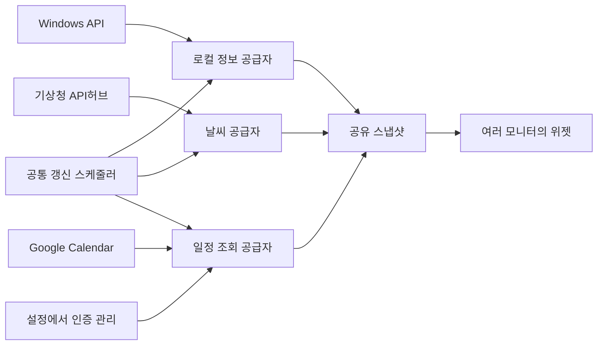
```mermaid
flowchart LR
    W[Windows API] --> LP[로컬 정보 공급자]
    O[기상청 API허브] --> HP[날씨 공급자]
    G[Google Calendar] --> CP[일정 조회 공급자]
    AU[설정에서 인증 관리] --> CP
    SC[공통 갱신 스케줄러] --> LP
    SC --> HP
    SC --> CP
    LP --> SS[공유 스냅샷]
    HP --> SS
    CP --> SS
    SS --> UI[여러 모니터의 위젯]
```

- 위젯은 데이터를 직접 요청하지 않고 필요한 데이터 키를 구독한다. 같은 날씨 격자·GPU·어댑터·볼륨을 보는 위젯은 공급자와 결과를 공유한다. 캘린더는 연결 ID·캘린더 ID·조회 기간을 기준으로 공유한다.
- 외부 통신은 공통 `HttpClient` 뒤로 모으고 **비동기 WinHTTP를 우선 검증**한다. API 통신에는 브라우저 쿠키가 필요 없으며 로그인 UI는 시스템 브라우저에서 처리한다. WinHTTP는 브라우저의 쿠키·자격 증명을 공유하지 않으므로 프록시 동작은 별도로 확인한다. [WinHTTP 특성](https://learn.microsoft.com/en-us/windows/win32/winhttp/about-winhttp)
- 동시 외부 데이터 요청은 앱 전체 2개를 초기 상한으로 제안한다. 토큰 교환·갱신은 별도의 인증 슬롯 1개로 직렬화하여 데이터 요청이 인증을 기다리며 서로 막히지 않게 한다. 같은 키의 진행 중 요청은 하나만 둔다.
- API 요청은 전체 기한 15초를 출발점으로 검증한다. 사용자가 브라우저에서 로그인하는 대기 시간은 별도이며 취소 가능하게 한다. DNS·연결·읽기 지연이 UI를 멈추지 않아야 한다.
- 페이지당 응답은 압축 해제 후 1MiB를 초기 상한으로 두고, 필요한 필드만 정규화한다. 기존 4MiB 날씨·일정 데이터 예산에는 교체 중인 구/신 캐시도 포함한다. 초과를 빈 결과로 취급하지 않고 마지막 완전한 결과와 조회 제한 상태를 유지한다.
- 공급자 어댑터가 주소·메서드·필드를 결정한다. 원격 텍스트에서 나온 주소를 추가 요청 대상으로 삼지 않는다. HTTPS 인증서 검증을 유지하고 다른 호스트로 인증 헤더를 전달하지 않는다.
- 마지막 구독 해제 시 수집 예약을 해제한다. 종료 시 예약 중단 → 요청 취소 → 완료 콜백 정리 → 핸들·버퍼 해제 순서를 고정한다. HTTP·PDH·장치 알림도 자원 해제 검증에 포함한다.

### 17.3 날씨 연결

**설정 흐름:** 기상청 API허브에서 본인 인증키 발급 → Tempos 설정에 입력 → 국내 지역 검색/선택 → 격자에 맞는 날씨 수신. 상세 제약은 18절을 따른다.

| 단계 | 호출·처리 | 보관할 결과 |
| --- | --- | --- |
| 지역 선택 | 공식 지역-격자표를 가공한 로컬 검색 인덱스 | 지역 코드·표시명·위경도·격자 nx/ny·표 버전 |
| 실황 | API허브의 `getUltraSrtNcst` | 기온·강수형태·습도·바람 등 필요한 실황 |
| 가까운 예보 | `getUltraSrtFcst` | 다음 시간대 기온·하늘상태·강수형태·강수확률 등 |
| 당일 최고/최저 | `getVilageFcst` | 날짜별 TMN/TMX, 필요한 단기예보 |
| 낮밤·배경 | 일출/일몰 로컬 계산 + 관측/예보 상태 정규화 | 일회성 배경 전환 예약·정적 도형 상태 |

기본 주소는 `https://apihub.kma.go.kr/api/typ02/openApi/VilageFcstInfoService_2.0/`이며 `authKey`, `dataType=JSON`, `base_date`, `base_time`, `nx`, `ny`, 페이지 변수를 사용한다. 같은 격자라도 자료 종류별 요청은 구분하고 위젯 인스턴스들이 공유한다. [기상청 API허브 동네예보 조회](https://apihub.kma.go.kr/apiList.do?seqApi=10)

- 같은 격자의 여러 위젯은 자료별 요청과 파싱 결과를 공유한다. 지역명 검색은 로컬에서 처리하고 외부에는 인증키·격자·자료 시각 등 조회 변수만 전달한다.
- 낮밤 배경 때문에 일출 API를 매번 추가 호출하지 않는다. 단위·테마·투명도 변경도 외부 요청을 발생시키지 않는다.
- 키 미설정·인증 실패·지역 미지원·발표 자료 준비 중·오프라인을 구분한다. 실패해도 다른 국가의 날씨 공급자로 조용히 바꾸지 않는다.
- Open-Meteo는 해외 지역 지원이 필요해질 때 별도 선택 공급자로 검토한다. 기상청의 키와 Open-Meteo의 이용 조건은 별개이며 관측값·예보값을 출처 없이 혼합하지 않는다.

### 17.4 Google Calendar 연결

**사용자에게 필요한 것:** 자신의 Desktop OAuth 클라이언트 설정과 연결할 Google 계정. Google 비밀번호를 Tempos에 입력하지 않는다. 첫 버전은 연결 1개에서 여러 캘린더를 선택하는 구조다.

**초기 준비와 앱 설정**

1. Google Cloud 프로젝트에서 Calendar API를 사용 설정하고 OAuth 동의 화면을 구성한다. 테스트 모드이면 사용할 계정을 테스트 사용자로 등록한다.
2. OAuth 클라이언트를 **데스크톱 앱** 유형으로 만든다. 서비스 계정 키나 일반 API 키로 개인 일정 로그인을 대체하지 않는다.
3. Tempos의 `설정 → 캘린더 연동`에서 클라이언트 ID를 입력한다. 발급된 설정 JSON 가져오기를 보조 경로로 제공하고, 함께 발급된 클라이언트 구성값이 필요하면 보호 저장한다. 가져온 파일에 들어 있는 임의의 인증 서버 주소는 사용하지 않는다.
4. `Google 연결`을 누르면 기본 브라우저에서 계정 선택과 조회 권한 동의를 진행한다.
5. 연결 성공 후 읽을 수 있는 캘린더 목록에서 표시할 항목을 선택한다. 표시 색·시간대·갱신 주기도 이 설정에서 관리한다.

클라이언트 정보가 아직 없어도 날짜 달력은 사용 가능하다. 설정 준비 절차와 브라우저 인증은 [Google 설치형 앱 OAuth 안내](https://developers.google.com/identity/protocols/oauth2/native-app)를 따른다. 일반 배포용 공통 OAuth 프로젝트와 심사가 필요한지는 배포 단계에서 별도로 검토한다.

**인증 흐름과 조회 권한**

- 연결 시 임시 `state`와 PKCE S256 값을 만들고, `127.0.0.1`의 사용 가능한 포트에 로그인 응답 수신기를 연다. 정상 응답·취소·시간 초과 후 닫으며 앱 상주 서버로 남기지 않는다.
- 시스템 브라우저의 Google 동의 화면에서 받은 코드를 검증한 뒤 토큰으로 교환한다. 비밀번호는 브라우저와 Google 사이에서만 처리한다. OAuth 관련 세부값은 위젯에 표시하지 않는다.
- 요청 권한은 `https://www.googleapis.com/auth/calendar.calendarlist.readonly`와 `https://www.googleapis.com/auth/calendar.events.readonly` 두 개다. 로그인에 필요하지 않은 Gmail·Drive·프로필 권한을 함께 요청하지 않는다. [캘린더 권한 정의](https://developers.google.com/workspace/calendar/api/auth)
- 데스크톱 앱의 클라이언트 ID는 사용자 비밀번호가 아니다. 인증 보호는 PKCE·응답 검증·토큰 보호로 구성하며 배포본 안의 클라이언트 비밀값만으로 보호된다고 간주하지 않는다.

| 목적 | 허용하는 연결 | 동작 |
| --- | --- | --- |
| 브라우저 로그인 | `https://accounts.google.com/o/oauth2/v2/auth` | 계정 선택·조회 동의 |
| 코드 교환/토큰 갱신 | `POST https://oauth2.googleapis.com/token` | 인증에만 사용 |
| 캘린더 목록 | `GET https://www.googleapis.com/calendar/v3/users/me/calendarList` | 목록·표시명·색·시간대·접근 수준 조회 |
| 선택 캘린더 일정 | `GET https://www.googleapis.com/calendar/v3/calendars/{calendarId}/events` | 기간 제한 일정 조회, ID는 URL 경로에 맞게 인코딩 |

캘린더 목록과 일정 API는 [CalendarList.list](https://developers.google.com/workspace/calendar/api/v3/reference/calendarList/list), [Events.list](https://developers.google.com/workspace/calendar/api/v3/reference/events/list)를 따른다. Calendar 경로에는 GET만 허용하고 일정 생성·수정·삭제·참석 응답 메서드를 제공하지 않는다. 인증 서버의 POST와 일정 변경은 분리한다.

**일정 수신과 갱신**

- 목록은 연결 직후·연동 설정 열기·명시적 목록 갱신 때 읽고 페이지를 끝까지 처리한다. 목록 페이지가 미완료인데 기존 캘린더가 삭제됐다고 판단하지 않는다. `freeBusyReader`처럼 제목을 읽을 권한이 없는 항목은 설정에서 제한을 설명한다.
- 선택한 캘린더만 조회한다. 필요한 오늘/14일/월간 그리드 범위를 16.11절대로 계산하고 `timeMin`, `timeMax`, `singleEvents=true`, `orderBy=startTime`을 보낸다.
- 초기 페이지 크기는 100개로 제안한다. `nextPageToken`을 끝까지 처리하고 제목·시작/종료·취소 상태·반복 인스턴스 정보 등 화면에 필요한 필드만 요청한다. 첨부 파일·참석자 명단·긴 설명 본문은 초기 범위에 포함하지 않는다.
- 완성된 새 결과로 해당 기간을 교체하여 Google에서 수정·삭제된 내용을 다음 성공 조회에 반영한다. 페이지 중간 실패나 메모리 예산 초과로 기존 일정이 갑자기 사라지지 않게 한다.
- 기본 조회는 5분이며 위젯별 1/5/15/30분 설정을 따른다. 날짜·일정 시작/종료에 따른 로컬 표시 변경은 캐시로 처리한다. 상시 서버가 필요한 푸시 수신은 초기 범위에 넣지 않는다.

**토큰·장애·연결 해제**

- 지속 조회용 갱신 토큰을 확보하고 접근 토큰의 응답 만료값에 맞춰 필요할 때 갱신한다. 여러 요청이 동시에 갱신하지 않게 한다. 갱신 응답에 새 갱신 토큰이 없으면 기존 것을 유지한다.
- 401은 토큰 갱신 후 원 요청을 한 번만 재시도한다. `invalid_grant`·사용자 권한 철회는 설정의 재연결 상태로 전환하고 자동 로그인 창을 반복해서 띄우지 않는다.
- 403은 오류 이유를 확인한다. 할당량 문제는 백오프, API 미설정·조직 정책·권한 부족은 설정 안내로 분리한다. 404 등 개별 캘린더 접근 실패가 다른 캘린더 조회까지 막지 않게 한다.
- Google의 외부 사용자용 OAuth 프로젝트가 **Testing** 상태이면 이 앱의 Calendar 권한에 발급되는 갱신 토큰은 7일 만료 대상이다. 앱의 누수나 무한 재시도로 오인하지 않도록 설정 안내와 재연결 시험에 포함한다. [Google 갱신 토큰 만료 조건](https://developers.google.com/identity/protocols/oauth2#expiration)
- 앱의 `연결 해제`는 요청·예약 중단과 로컬 토큰·일정 캐시 제거를 수행한다. Google 계정 쪽 앱 권한 철회는 설정에서 계정의 권한 관리로 안내한다. 로컬 해제만으로 Google 권한까지 철회됐다고 표시하지 않는다.
- 위젯과 조회 전용 상세에는 날짜·일정·색상만 표시한다. Google 이름, 계정, 인증 상태, 동기화 시각, 오류 이유는 설정에만 둔다. 오래된 자료는 기존의 서비스 이름 없는 작은 상태 아이콘으로 구분한다.

### 17.5 Windows·바탕화면 연결

| 연결 | 설계할 흐름 | 복구 기준 |
| --- | --- | --- |
| CPU/GPU | PDH 쿼리 생성 → 카운터 등록 → 주기 수집 → 스냅샷 게시 | 초기 샘플·장치 변경은 재기준화, 마지막 구독 해제 시 쿼리 정리 |
| 메모리·시스템 | 메모리 API 호출, 장치명/OS 정적 캐시, 가동 시간 재계산 | 정보별 실패 격리, 정적 목록을 매 갱신마다 재조회하지 않음 |
| 네트워크 | 어댑터 목록 → GUID 선택 → 현재 식별자 대응 → 누적량 차이 | 재연결·초기화·절전 후 새 기준점부터 측정 |
| 디스크 | 볼륨 열거 → GUID 선택 → 마운트 경로 확인 → 용량 조회 | 제거·잠김·지연을 구분하고 같은 문자의 다른 장치를 자동 대체하지 않음 |
| 트레이 | `Shell_NotifyIcon`으로 앱 아이콘 1개 등록 | `TaskbarCreated` 후 재등록, 등록 실패 시 관리 창 유지 |
| 다중 모니터 | 디스플레이 경로·작업 영역·창 DPI 조회 → 저장한 배치 대응 | 연결·배율·작업 영역 변경 시 정수 그리드로 재배치, 원래 배치 보존 |
| 바탕화면 고정 | `DesktopHost`가 창 계층·입력·Z-order 담당 | Win+D·Explorer 재시작 시험, 미문서화 셸 의존은 별도 기록 |
| 절전·시각 변경 | Windows 통지 → 예약 재계산·필요 데이터 재수집 | 잠든 시간을 속도 계산에 포함하지 않고 다수 요청의 동시 폭주 방지 |

모니터 경로 조회는 [QueryDisplayConfig](https://learn.microsoft.com/en-us/windows/win32/api/winuser/nf-winuser-querydisplayconfig)를 후보로 사용하고 작업 영역·DPI 처리를 함께 검증한다. 트레이 복원은 [알림 영역 API](https://learn.microsoft.com/en-us/windows/win32/shell/notification-area)를 따른다. `^` 안에 놓일지 여부는 Windows와 사용자 설정을 존중한다. WorkerW 등 바탕화면 고정의 불확실성은 6절과 0단계 검증에 남긴다.

### 17.6 저장 위치와 연동 검증

| 저장 대상 | 저장 방식 | 내보내기 |
| --- | --- | --- |
| 테마·위치·크기·주기·도시·장치 선택 | `%LocalAppData%\Tempos`의 버전 있는 설정/레이아웃 JSON | 레이아웃으로 내보내기 가능 |
| OAuth 클라이언트 구성·갱신 토큰 | Windows DPAPI 사용자 범위로 보호한 별도 파일, JSON 설정과 분리 | 제외 |
| 기상청 인증키 | 공급자 종류와 함께 DPAPI 사용자 범위 보호, 설정에서는 마스킹 | 제외 |
| 접근 토큰·인증 임시값 | 필요한 동안 메모리에서만 유지 | 제외 |
| 일정 캐시·연동 캘린더 식별 정보 | 사용자 범위 보호 파일, 연결 ID/조회 기간으로 구분 | 제외 |
| 날씨 캐시 | 도시/필드/자료 시각이 있는 크기 제한 캐시 | 초기 내보내기 제외 |
| 진단 기록 | 오류 코드·처리 시간·요청 종류, 크기 제한 로그 | 토큰·인증 코드·일정 원문 제외 |

DPAPI는 `CryptProtectData`/`CryptUnprotectData`의 사용자 범위를 사용하고 머신 전체 공유 옵션은 사용하지 않는다. 다른 PC나 사용자로 설정을 옮겼을 때 인증 정보가 자동으로 따라간다고 보장하지 않으며 재연결 흐름을 둔다. [Windows DPAPI](https://learn.microsoft.com/en-us/windows/win32/api/dpapi/nf-dpapi-cryptprotectdata)

연동 검증은 **모의 응답으로 오류·취소·페이지·토큰 만료 재현 → 실제 장치/API로 연결 확인 → 여러 위젯을 함께 켜 수집 공유와 종료 후 자원 정리 확인** 순서로 설계한다. 구체적으로 프록시/오프라인, 잘못된 OAuth 클라이언트, 사용자 동의 거절, 조회 권한만 부여, 연결 해제 중 늦은 응답, Explorer/장치 재연결, 반복 연결·해제 후 메모리 추이를 확인한다. Google 실제 연결은 사용자가 준비한 클라이언트로 완료해야 하며 모의 로그인 결과로 대신하지 않는다.

## 18. 국내 기상청 연동의 가능 범위와 제약

**결론: 기상청 공식 API로 국내 날씨 위젯을 구성할 수 있다. 기본 연동안은 API허브의 지점/격자별 JSON 조회로 변경한다.** 기존 Open-Meteo 전제에서 달라지는 인증키, 자료 조합, 낮밤 계산, 출처 표시를 이 절에서 확정한다. 실키를 이용한 연결 시험은 아직 수행하지 않았다.

검토 기준은 2026-10-07의 공식 서비스 페이지와 공공데이터포털 `2609.zip` 안의 `260928` 활용가이드다. 포털 메타데이터와 첨부 문서의 접속 주소가 다르므로 경로·인증키 종류를 공급자 어댑터로 구분한다. [단기예보 서비스](https://www.data.go.kr/data/15084084/openapi.do), [열람한 최신 활용가이드](https://www.data.go.kr/cmm/cmm/fileDownload.do?atchFileId=FILE_000000007696658&fileDetailSn=1)

### 18.1 신청·키·호출량·이용 조건

| 항목 | 확인한 제약 | 설계에 반영할 동작 |
| --- | --- | --- |
| API허브 인증 | 회원가입 후 인증키 발급. 키는 가입자 본인만 사용하며 양도·대여 불가 | 사용자 본인 키를 설정에 입력. 개발자 개인 키를 모든 배포본에 넣지 않음 |
| API허브 일반회원 한도 | 일 최대 20,000건·5GB. 서비스 상황에 따라 변경 가능 | 키별 호출 추정량·제한 응답을 관리하고 발표 자료/격자별로 요청 공유 |
| 공공데이터포털 경로 | 별도 `serviceKey` 사용. 서비스 페이지에 개발계정 트래픽 10,000, 운영 증량 신청 안내 | API허브의 `authKey`와 혼용하지 않음. 첫 버전 자동 우회 경로로 추가하지 않음 |
| 지역·해상도 | 국내 동네예보는 약 5km 격자 기준. 행정구역 이름과 격자 범위는 일대일이 아님 | 동일 격자 지역은 수집을 공유하고 상세에서 대표 지역임을 설명 |
| 결측·범위 밖 | 해상·관측 공백·자료 지연 등이 있음 | 해당 필드만 ‘—’/지연. 결측을 맑음·0℃·강수 0%로 변환하지 않음 |
| 비용·라이선스 | 조회서비스는 무료, 공공누리 제1유형 출처 표시 조건 | 출처와 링크 유지. 데이터 이용허락과 계정·호출 정책을 별개로 관리 |

한도·키 사용 조건은 [API허브 이용안내](https://apihub.kma.go.kr/apiInfo.do), 포털 경로와 트래픽은 [공공데이터포털 서비스 정보](https://www.data.go.kr/data/15084084/openapi.do)에 근거한다. 제1유형은 출처 조건 아래 영리 이용·변경도 허용하지만 기관이 앱을 보증하는 것처럼 표시하지 않는다. [공공누리 제1유형](https://www.kogl.or.kr/info/licenseType1.do)

- 초기 구조는 사용자의 앱이 본인 키로 기상청에 직접 접속한다. 별도 Tempos 서버 운영이나 API 프록시를 전제하지 않는다. 향후 공통 키를 쓰는 공개 배포 구조는 제공기관의 키 사용 조건과 운영 승인을 다시 검토한다.
- 키는 DPAPI 사용자 범위로 저장하고 설정·레이아웃 내보내기에서 제외한다. API가 쿼리 문자열로 키를 받으므로 전체 요청 URL을 로그에 남기지 않는다. 인코딩은 한 번만 수행하고 키 자체를 오류 메시지에 출력하지 않는다.
- 앱의 호출 집계는 이 설치본의 추정치다. 같은 키를 다른 프로그램이나 PC에서도 쓰면 서버의 실제 사용량과 다를 수 있으므로 서버의 제한 응답을 우선한다. 인증 실패·만료는 재입력, 일일 한도 소진은 자동 요청 중단과 재개 시각 안내로 처리한다.
- 공개 API라 해도 운영 중단·지연이 없다고 보장하지 않는다. 서비스 변경 시 API 주소를 UI 곳곳에서 수정하지 않도록 공급자 설정과 문서 버전을 한곳에서 관리한다.

### 18.2 어떤 자료로 어떤 화면을 만드는가

| 화면 정보 | 사용할 기상청 자료 | 조합·표시 규칙 |
| --- | --- | --- |
| 현재 기온 | 초단기실황 `T1H` | 관측 기준 시각을 보존. 예보 기온으로 바꾸면 ‘예보’라고 구분 |
| 현재 비·눈 | 초단기실황 `PTY`, 필요하면 `RN1` 보조 | 비/눈/혼합/빗방울/눈날림을 구분하고 강수확률로 현재 강수를 추정하지 않음 |
| 맑음·구름 | 초단기예보의 해당 시간대 `SKY` | 실황에 없는 하늘상태는 ‘하늘 예보’ 보조 정보로 구분. 현재 시간대에 맞는 자료가 없으면 중립 |
| 다음 4시간 | 초단기예보 `T1H`, `SKY`, `PTY`, `POP` | 시간 슬롯별로 결합. 필요한 필드가 없으면 해당 항목만 생략하거나 단기예보로 명시적 보완 |
| 오늘 최고·최저 | 단기예보 `TMX`, `TMN` | ‘오늘 예상 최고/최저’. 남은 시간별 기온만으로 하루 최고/최저를 다시 계산하지 않음 |
| 습도·바람 | 실황 `REH`, `WSD`, `VEC` | 상세 정보용. 최초 화면에 모든 필드를 추가하지 않음 |
| 밤·일출·일몰 | 지역 위경도·날짜를 이용한 로컬 천문 계산 | 기상청 실황 필드인 것처럼 표현하지 않음. 배경 전환용 계산값 |
| 안개·뇌우 | 기본 자료만으로 관측 현상을 모두 확인할 수 없음 | 습도만으로 안개를 만들지 않음. `LGT` 예보는 예보 영역에서 구분하고 현재 낙뢰 관측처럼 사용하지 않음 |

기상청의 `PTY`/`SKY`와 Open-Meteo의 WMO 코드는 다른 체계다. 별도 매핑을 거쳐 공통 `WeatherCondition`으로 정규화한다. 기상청 자료별 코드와 결측값은 최신 활용가이드를 기준으로 시험한다. 초단기예보 `POP`은 2026-06-23부터 제공 항목에 추가된 자료이므로 오래된 안내의 ‘항상 없음’을 전제로 구현하지 않는다. [API허브 변수 안내](https://apihub.kma.go.kr/apiList.do?seqApi=10), [2026년 9월 활용가이드](https://www.data.go.kr/cmm/cmm/fileDownload.do?atchFileId=FILE_000000007696658&fileDetailSn=1)

- `SKY` 예보를 배경의 보조 근거로 사용하는 경우, 위젯/상세에 실황과 하늘 예보의 구분을 유지한다. 미래 비 예보를 현재 비 배경으로 앞당기지 않는다. 비/눈 실황이 있으면 그 현상을 우선한다.
- 각 필드에 공급자, 자료 종류, 발표 시각, 관측/예보 유효 시각, 조회 시각을 둔다. 요청 성공 시각을 실제 관측 시각처럼 표시하지 않는다. 공급자가 중간 수정의 상세 시각을 주지 않으면 ‘발표 기준’과 ‘조회 시각’까지만 표시한다.
- 하루가 지난 실황을 ‘현재’로 유지하지 않는다. 마지막 확인 자료가 2시간 넘게 지연되면 날씨 현상 배경은 중립으로 바꾸는 초기 정책을 제안한다. 마지막 수치는 지연 표시와 함께 24시간까지만 보관·표시하고 이후 제거한다. 미래 예보는 별도의 유효 기간을 따른다.
- 낮밤은 지역/날짜당 하루 한 번 계산하고 일출·일몰 경계에만 배경 변경을 예약한다. 알고리즘과 라이선스는 구현 전 검토하고 국내 지역·계절별로 한국천문연구원 자료와 대조한다. 산이나 건물에 가려 실제 해가 보이는 시각까지 보장하지 않는다. [천문 계산의 원리·한계](https://gml.noaa.gov/grad/solcalc/calcdetails.html), [한국천문연구원 출몰시각 자료](https://www.data.go.kr/data/15012688/openapi.do)
- 한국천문연구원 API를 실제 런타임 보조 연동으로 채택할 경우에는 별도 활용신청·권한·캐시를 설계해야 한다. 현재 기본안은 로컬 계산이며, 일출 정보만을 위해 매 갱신마다 두 번째 기관을 호출하지 않는다.

### 18.3 발표 시각과 위젯 갱신 주기의 차이

| 자료 | 최신 활용가이드의 기준 | 요청 스케줄 설계 |
| --- | --- | --- |
| 초단기실황 | 매시 정시 생성, 정시 자료는 10분 이후 호출. 10분마다 최신 자료 갱신 안내 | 사용할 `base_date/base_time`을 KST로 결정. 같은 발표 시각도 수정될 수 있어 영구 캐시하지 않음 |
| 초단기예보 | 매시 30분 생성, 45분 이후 호출. 기온·습도·바람의 10분 갱신 안내 | 발표 경계와 수정 주기를 분리. 시간대에 맞는 6시간 예보에서 필요한 4개 슬롯 사용 |
| 단기예보 | 02/05/08/11/14/17/20/23시, 안내상 각 시각 10분 이후 제공 | 일 8개 발표 단위를 기본으로 조회. 아직 생성되지 않은 다음 발표를 요청하지 않음 |

위 시각은 2026년 9월 가이드의 계획 입력값이며 서버의 정시 제공 보장은 아니다. API허브의 전국 격자 파일 서비스와 지점 JSON 서비스의 발표 인자·생산 주기를 혼동하지 않는다. [활용가이드](https://www.data.go.kr/cmm/cmm/fileDownload.do?atchFileId=FILE_000000007696658&fileDetailSn=1)

- 사용자 갱신 설정은 5/15/30/60분을 유지한다. 기상청 실황·초단기 외부 요청은 자료별 최소 10분 간격을 초기 제한으로 두며, 5분 선택 시 중간 화면 갱신은 캐시로 수행하고 실효 주기를 설정에서 설명한다. 단기예보는 새 발표가 필요할 때만 요청한다.
- 00:05에는 전날 마지막 유효 발표로 날짜를 넘겨 계산한다. PC 시간대가 해외여도 국내 날씨의 발표 시각은 KST다. OS 시각 변경·절전 복귀 시 마지막 자료와 현재 시각을 비교해 재예약한다.
- 같은 `base_time`이라는 이유만으로 응답을 영원히 재사용하지 않는다. 실황·초단기 수정 반영은 마지막 조회·자료 해시와 필요 시 버전 정보로 판단한다. 버전 확인도 호출량이므로 모든 조회 앞에 무조건 추가하지 않는다.
- 최신 자료가 아직 없으면 이전 유효 자료를 유지하고 생성 지연으로 표시한다. 이전 발표 확인은 한 단계만 시도하며 임의의 과거 시각을 반복 탐색하지 않는다. 다음 재시도는 공급자 최소 간격·백오프·할당량을 함께 적용한다.
- 기본 15분, 1격자, 실황/초단기가 각각 1페이지, 단기가 2페이지라고 가정하면 `96 + 96 + 8×2 = 208회/일`이다. 이는 설계상 산술 예시이며 실제 응답 페이지·초기 최고/최저 보충·재시도·수동 갱신은 추가된다. 같은 격자의 위젯 수만 늘어나는 경우에는 이 횟수를 곱하지 않는다.

### 18.4 최고·최저, 지역표, 응답 오류 처리

- 최신 발표에는 오늘 최저기온, 늦은 시각에는 오늘 최고기온도 없을 수 있다. 날짜별 `TMN/TMX`를 받은 즉시 작은 당일 캐시에 보존한다. 처음 실행해 오늘 값이 없으면 가이드상 당일 두 값이 있는 02시 발표를 최대 한 번 보충 조회하고, 그 발표가 아직 없으면 전날 유효 발표를 사용한다. 제공 보유 기간 밖이거나 필드가 없으면 ‘—’로 남긴다.
- 시도·시군구·읍면동 선택은 공식 지역-격자표의 버전 있는 인덱스로 제공한다. 원본 XLSX 전체를 메모리에 상주시키지 않고 검색 중 필요한 부분만 읽는다. 폐지·신설 지역과 같은 지명을 구분하며 이전 코드가 없어졌을 때 임의의 다른 지역으로 바꾸지 않는다.
- 좌표에서 격자를 계산하는 기능을 추가한다면 기상청 변환 규칙과 반올림을 그대로 검증한다. 격자 범위 안이라는 이유만으로 모든 바다·북한·해외 지점이 정상 지원된다고 표시하지 않는다. 초기 UI는 제공 여부를 확인한 국내 지역 목록으로 제한한다.
- `dataType=JSON`이어도 게이트웨이 오류가 XML/텍스트로 올 수 있다고 가정한다. HTTP 상태와 본문 `resultCode`를 모두 확인하고, `00` 정상 응답 안에서도 필드·페이지·자료 시각을 검증한다. XML은 외부 엔터티를 허용하지 않는다.
- `03` 자료 없음, `22` 호출 한도, `30` 미등록 키, `31` 만료 등은 원인별 상태로 분리한다. 정해진 계약과 다른 파라미터 오류를 반복 재시도하지 않는다. 숫자형 결측 표식과 강수량의 범주형 문자열을 단순 숫자로 파싱하지 않는다.
- `numOfRows`는 페이지당 행 수이며 전체 자료 개수가 아니다. 페이지 메타데이터로 필요한 자료의 완전성을 확인한 뒤 스냅샷을 교체한다. 전체 필드를 반환하는 API에 없는 서버 측 필드 필터를 가정하지 않고, 수신 직후 필요한 날짜/필드만 보관한다.

### 18.5 출처 표시와 추가 완료 기준

기상청은 2026-09-18 시행 개정에 따른 기상기후데이터 출처 표시 안내를 게시했다. 따라서 날씨 위젯에는 **‘자료: 기상청’**을 작은 글자로 유지하고, 상세에 서비스명·원문 링크·발표/유효 시각·공공누리 조건을 표시하는 안으로 설계한다. 위젯의 시안에도 이후 이 공간을 반영한다. 캘린더의 Google 문구를 숨기는 기존 요구사항은 그대로 유지한다. [기상청 공식 출처 표시 공지·가이드](https://apihub.kma.go.kr/notice.do?seqNotice=57)

- S/Slim에서 출처가 들어갈 공간을 먼저 확보하고 보조 수치를 줄인다. 테마·투명도 변경에도 출처의 가독성을 함께 확인한다. 기상청 공식 앱이나 기관이 후원하는 앱처럼 표시하지 않는다.
- 실제 배포 전 최신 출처 표시 가이드에 맞는 문구·위치·링크를 확인한다. 예보 기호 변환과 낮밤 계산을 기상청의 원문 자료와 혼동시키지 않는다.
- **연동 E2E 추가:** 잘못된 키/만료/한도, 00:05 날짜 경계, 10분·45분 제공 경계, 같은 발표 시각의 수정 응답, 당일 최저 누락, 첫 실행 보충 조회, 결측·빈 페이지·XML 오류, 동일 격자 중복 위젯, PC 해외 시간대, 기상청 출처 표시를 검증한다.
- 실제 키와 표본 지역 응답으로 확인한 항목만 연동 완료로 기록한다. 문서 열람·모의 응답 시험·실제 서비스 시험을 구분하며, 발표 시각이나 호출 한도의 변경 가능성을 설정 진단에서 확인할 수 있게 한다.
